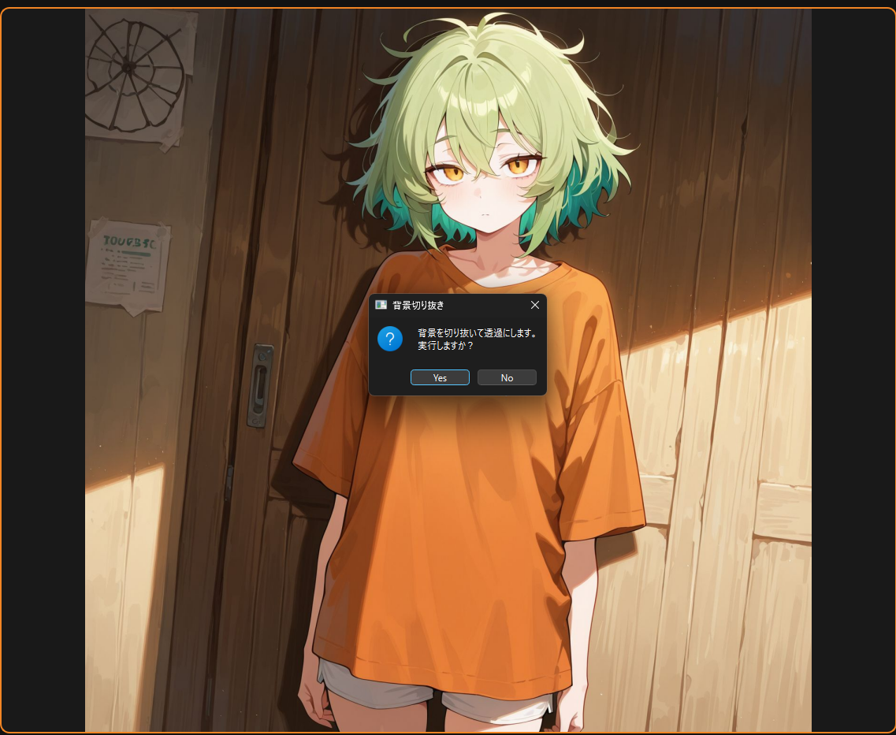
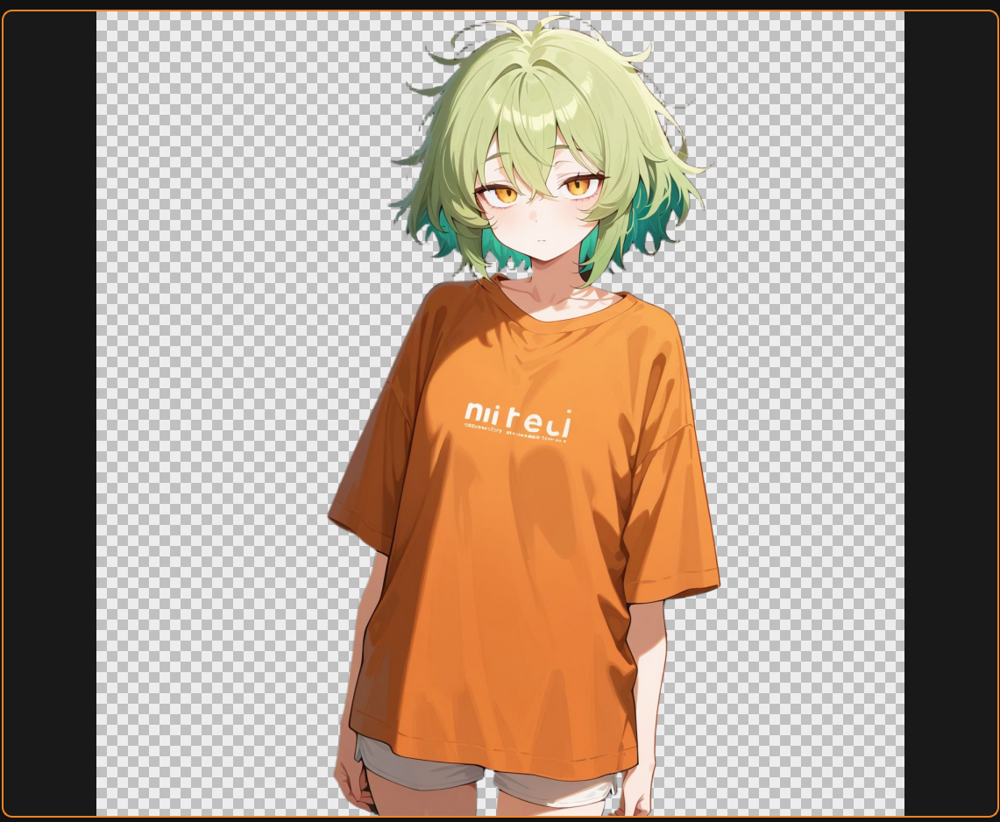
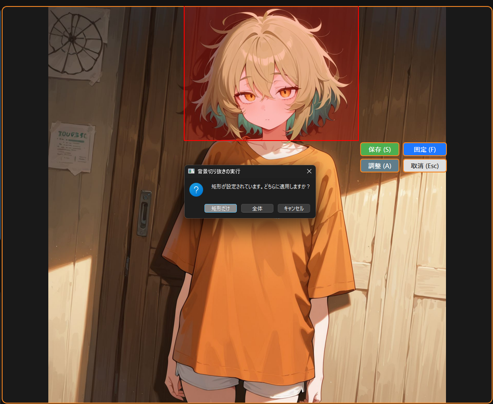
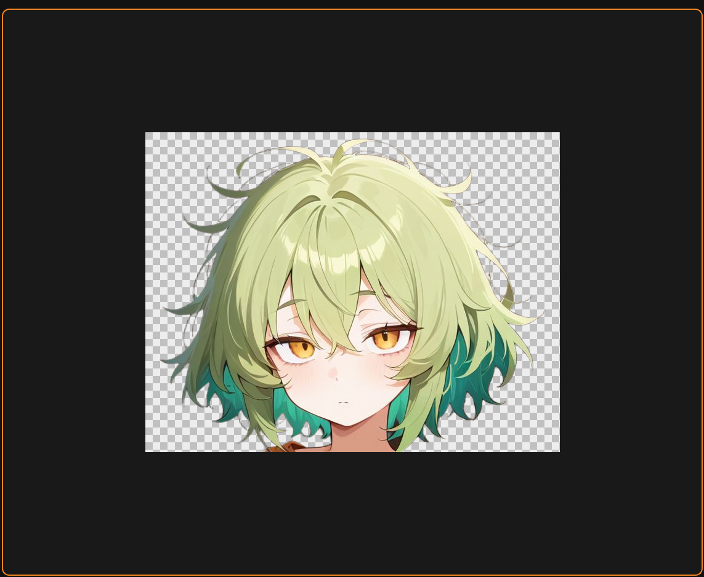
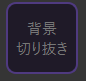
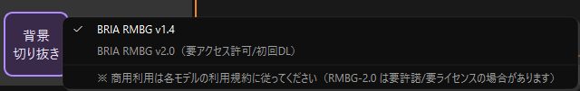

# gazou_kiritori
画像切り取りツールLora素材作成に使いやすいかも

ドラッグや固定サイズで画像を切り抜き、簡単に保存できます


## 主な特徴
- ドラッグ＆ドロップで読み込み(画像、圧縮ファイル、フォルダ)
- 固定サイズや自由な矩形でのトリミング
- 切り出し位置の微調整、矩形の移動や位置調整
- 保存画像の自動連番と上書き保存を選択可能
- プレビューウインドウで保存前に切り取り画像の確認
- 切り抜き予定の解像度表示ウインドウ
- ZIP / RAR / 7Z などの圧縮ファイルもフォルダのように参照  
　※ パスワード付きファイルには非対応  
　※ RARの読み込みには外部ツールのインストールが必要（後述）
- 一括切り取り機能で同じ設定のまま複数画像を自動で切り取り可能（v1.1.1）
- 背景切り抜き（オプション）（v1.2.0）  
　※ 使う場合は別途セットアップ（後述）

## 要件

### アプリ本体
- Python（3.12で動作確認済み、たぶん3.10以上であれば動きます）
- Pillow
- PyQt6
- rarfile（RAR 対応）
- py7zr（7z 対応）

### 背景切り抜き（オプション機能）
- torch（CPU または CUDA 版）
- torchvision（環境によって必要）
- numpy
- transformers
- timm
- kornia
- huggingface_hub（モデルのダウンロード/キャッシュに使用）

## インストール手順
1. このリポジトリを任意のフォルダにクローンまたはzipダウンロード

```
git clone https://github.com/99a-bc/gazou_kiritori.git
```

2. `install_app.bat`をダブルクリック

## 起動方法
- `run_gazou_kiritori.bat` をダブルクリック

## 使い方
1. メニューバー上部のファイル→画像を開く or 画像やフォルダ、圧縮ファイルをドラッグ&ドロップ
   
   - フォルダ内のオブジェクトの数が多い場合、サムネイル作成に時間がかかる場合があります

2. ドラッグで切り抜き範囲を矩形選択
   または固定切り出しメニューより固定サイズを選択し、矩形をドラッグして任意の位置に移動

3. 保存ボタンをクリック or キーボードの s を押下

   - 保存方法メニューのラジオボタンより、連番保存か既存画像への上書き保存を選択可能です

   - 保存フォルダを変更する場合は、保存先メニューの保存先指定のラジオボタン→参照から任意のフォルダを指定してください  
   　（メニューバー上部のファイル→「保存先フォルダを選択」からも選択可能）
   
   - 現在の保存先は右下付近に表示されます


##  RAR（.rar）を読み込む場合の注意点

RAR を扱いたい場合は以下のソフトをインストールし、コマンドのパスが通っている必要があります

■ 動作確認済みの外部ツール  
7-Zip

インストール後、システム環境変数のPathを通してください


## 背景切り抜き（オプション機能） 

<p>画像の背景を切り抜くことができます</p>
<table>
  <tr>
    <td></td>
    <td style="vertical-align: middle; text-align: center; font-size: 28px; padding: 0 12px;">→</td>
    <td></td>
  </tr>
</table>　　


<p>選択した範囲のみを切り抜くことも可能です</p>

<table>
  <tr>
    <td></td>
    <td style="vertical-align: middle; text-align: center; font-size: 28px; padding: 0 12px;">→</td>
    <td></td>
  </tr>
</table>　　
　　

背景切り抜き機能を使う場合だけ、以下を実行してください

※重要：本機能で導入する RMBG v1.4 / v2.0 は **非商用利用のみ** です  
**商用目的（収益化、業務利用、製品/サービスへの組み込み等）では利用できません**  
（商用利用したい場合は提供元の商用ライセンス/別契約が必要になります）

### 1) 背景切り抜き用の依存関係を入れる（CPU / GPU 選択）
`enable_bg.bat` を実行します  途中で CPU / GPU（cu128 など）を選択できます。GPUを使用する場合は自身の環境に合わせてcu***を選択してください

- 既に torch が入っている場合でも、選択したモードに合わせて入れ直します（CPU ↔ GPU の切り替えを想定）

### 2) 使いたいモデルをインストールする（※非商用利用のみ）
モデルはアプリ配下の `.\hf_home\hub\` にキャッシュされます

- RMBG v1.4を入れる → `install_rmbg_1_4.bat`

- RMBG v2.0を入れる  
  v2.0 は Hugging Face 側で **アクセス許可/承諾** と **ログイン（Access Token）** が必須です  
  **必ず先に** 以下を実行してから `install_rmbg_2_0.bat` を実行してください

  1. Hugging Face にログインし、 [`briaai/RMBG-2.0`](https://huggingface.co/briaai/RMBG-2.0) を開く

  2. モデルのアクセス許可（承諾）を行う  
     - ページ上に「Access」「Agree」「Request access」等の表示がある場合は、案内に従って承諾してください  
     - 承諾が完了していないと、`install_rmbg_2_0.bat` 実行時に 401 / GatedRepoError で失敗します

  3. Access Token を作成する（Hugging Face）  
     1) 右上のアカウントアイコン → **Settings**  
     2) 左メニューの **Access Tokens**  
     3) **New token**（Create new token）  
     4) 権限（Role）は **Read** を選択して作成  
     5) 表示されたトークン文字列をコピー（※基本的に表示は1回だけなので注意してください。保存し忘れた場合は、そのトークンを無効化（revoke）して新しく作り直してください）

  4. `hf_login_visible_sjis.bat` を実行して Access Token を登録  

  5. `install_rmbg_2_0.bat` を実行

### 3) アプリ側の挙動
- 背景切り抜きモデルが1つも入っていない場合、背景切り抜きボタンはグレーアウトします  
  
- 1つ以上モデルが入っている場合ボタンが有効になり、右クリックでモデル選択ができます（未インストールのモデルはグレーアウトします）  
  

## 便利機能

- 矩形の微移動  

  キーボードの矢印キーで任意の方向に1px単位で移動

- 矩形の微調整  

  調整ボタンで微調整パネルを呼び出し、任意の辺を△▽ボタンより1px単位で伸縮  
    
  

- 保存ボタンパネル、微調整パネルの一時非表示  

  マウスホイール押下で一時非表示

- 前/次の画像へ移動

  ctrl ＋ ← or →　キー　

  またはマウスジェスチャ：右クリック押下しながら左右ドラッグ(左：前画像、右：次画像)  
  またはメイン画像エリア下部の　◁　▷　ボタンを左クリック  
    

- 前/次のフォルダへ移動

  shift ＋ ← or →　キー　

  またはマウスジェスチャ：shift ＋右クリック押下しながら左右ドラッグ(左：前フォルダ、右：次フォルダ)  
  またはメイン画像エリア下部の　◁　▷　ボタンを右クリック   

- 拡大/縮小

  マウスホイール回転
  
  ※拡大中はマウスのセンターボタンを押しながらドラッグでパン移動可能


- 背景色の変更

  メイン画像エリア、プレビューエリアの背景色を カラー選択アイコンで切り替え可能  
  アイコンを右クリックすると任意の色にカスタムが可能  

  


## その他

- 本アプリはフルスクリーン前提で作成しています  
  ウインドウ状態でも動作はしますが、レイアウトなどは考慮していないため、フルスクリーンでの利用をお勧めします

- 背景切り抜き機能（RMBG）はオプションです  
  モデル本体は本リポジトリに同梱していないため、READMEの手順に従って別途インストールしてください

- 背景切り抜き機能で GPU を使用する場合は NVIDIA ドライバが必要です  
  `enable_bg.bat` で環境に合う cu*** を選択してください（うまく動かない場合は CPU を選択してください）  
  ※通常の画像切り取り機能（矩形切り抜き等）では GPU は使用しません

- 本アプリの一部アイコンは [Tabler Icons](https://tablericons.com/) を使用しています（MIT License）

- 本アプリの利用により生じたいかなる損害についても作者は責任を負いません  
  自己責任で利用してください

## 変更履歴

### v1.2.0
- 背景切り抜き機能追加

### v1.1.1
- 一括切り取り機能追加
- 画像回転時に矩形が意図せず変形する症状を修正
- 上書き保存かつ保存先が画像読込元と異なる場合、保存時にメインプレビューがリセットされていた症状を修正
- run_gazou_kiritori.bat を activate.bat 経由ではなく、venv の python を直接呼ぶ方式に変更

### v1.1.0
- 機能多数追加、バグ修正

### v1.0.0
- リリース

