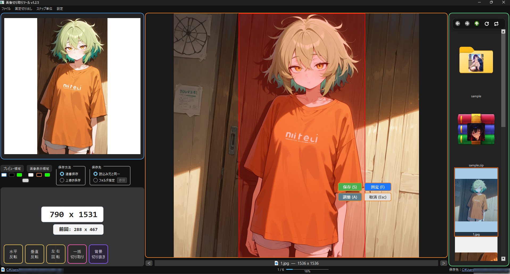
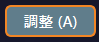
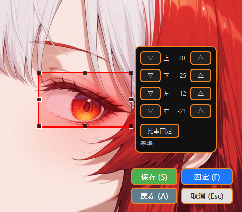
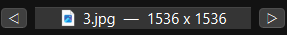
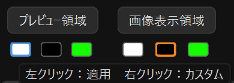

# gazou_kiritori
画像切り取りツール。Lora素材作成に使いやすいかも

ドラッグや固定サイズで画像を切り抜き、簡単に保存できます



## 主な特徴
- ドラッグ＆ドロップで読み込み(画像、圧縮ファイル、フォルダ)
- 固定サイズや自由な矩形でのトリミング
- 切り出し位置の微調整、矩形の移動や位置調整
- 保存画像の自動連番と上書き保存を選択可能
- プレビューウインドウで保存前に切り取り画像の確認
- 切り抜き予定の解像度表示ウインドウ
- ZIP / RAR / 7Z などの圧縮ファイルもフォルダのように参照  
　※ パスワード付きファイルには非対応  
　※ RARの読み込みには外部ツールのインストールが必要（後述）

## 要件
- Python(3.12で動作確認済み、たぶん3.10以上であれば動きます)
- Pillow
- PyQt6
- rarfile（RAR 対応）
- py7zr（7z 対応）

## インストール手順
1. このリポジトリを任意のフォルダにクローンまたはzipダウンロード

```
git clone https://github.com/99a-bc/gazou_kiritori.git
```

2. `install.bat`をダブルクリック


## 起動方法
- `run_gazou_kiritori.bat`をダブルクリック


## 使い方
1. メニューバー上部のファイル→画像を開く or 画像やフォルダ、圧縮ファイルをドラッグ&ドロップ
   
   - フォルダ内のオブジェクトの数が多い場合、サムネイル作成に時間がかかる場合があります

2. ドラッグで切り抜き範囲を矩形選択
   または固定切り出しメニューより固定サイズを選択し、矩形をドラッグして任意の位置に移動

3. 保存ボタンをクリック or キーボードの s を押下

   - 保存方法メニューのラジオボタンより、連番保存か既存画像への上書き保存を選択可能です

   - 保存フォルダを変更する場合は、保存先メニューの保存先指定のラジオボタン→参照から任意のフォルダを指定してください  
   　（メニューバー上部のファイル→「保存先フォルダを選択」からも選択可能）
   
   - 現在の保存先は右下付近に表示されます


##  RAR（.rar）を読み込む場合の注意点

RAR を扱いたい場合は以下のソフトをインストールし、コマンドのパスが通っている必要があります

■ 動作確認済みの外部ツール  
7-Zip

インストール後、システム環境変数のPathを通してください

## 便利機能

- 矩形の微移動  

  キーボードの矢印キーで任意の方向に1px単位で移動

- 矩形の微調整  

  調整ボタンで微調整パネルを呼び出し、任意の辺を△▽ボタンより1px単位で伸縮  
    
  

- 保存ボタンパネル、微調整パネルの一時非表示  

  マウスホイール押下で一時非表示

- 前/次の画像へ移動

  ctrl ＋ ← or →　キー　

  またはマウスジェスチャ：右クリック押下しながら左右ドラッグ(左：前画像、右：次画像)  
  またはメイン画像エリア下部の　◁　▷　ボタンを左クリック  
    

- 前/次のフォルダへ移動

  shift ＋ ← or →　キー　

  またはマウスジェスチャ：shift ＋右クリック押下しながら左右ドラッグ(左：前フォルダ、右：次フォルダ)  
  またはメイン画像エリア下部の　◁　▷　ボタンを右クリック   

- 拡大/縮小

  マウスホイール回転
  
  ※拡大中はマウスのセンターボタンを押しながらドラッグでパン移動可能


- 背景色の変更

  メイン画像エリア、プレビューエリアの背景色を カラー選択アイコンで切り替え可能  
  アイコンを右クリックすると任意の色にカスタムが可能  

  


## その他

本アプリはフルスクリーン前提で作成しています  
ウインドウ状態でも動作はしますが、レイアウトなどは考慮していないため、フルスクリーンでの利用をお勧めします


本アプリの一部アイコンは Tabler Icons（https://tablericons.com/）を使用しています（MIT License）

