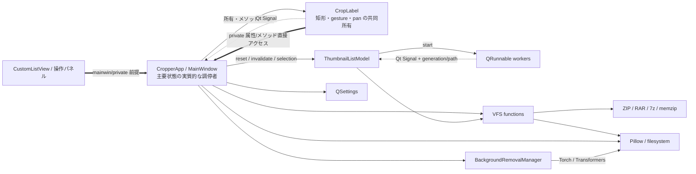
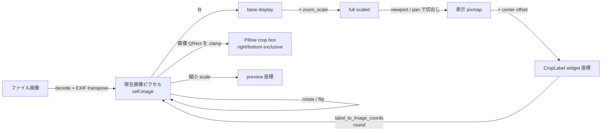
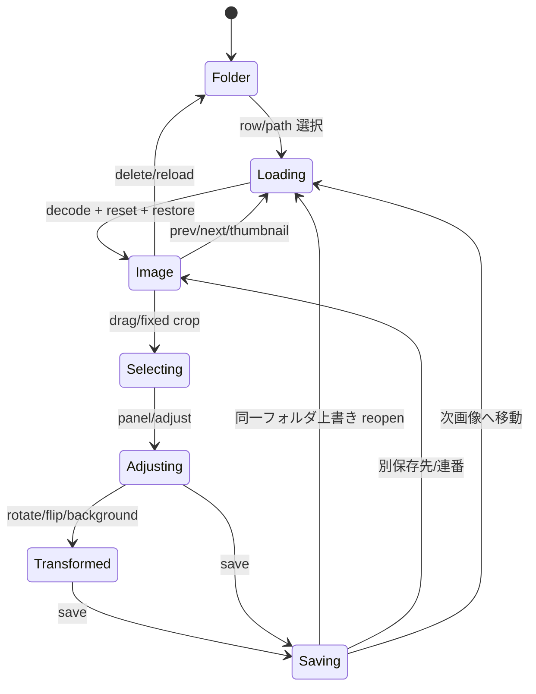
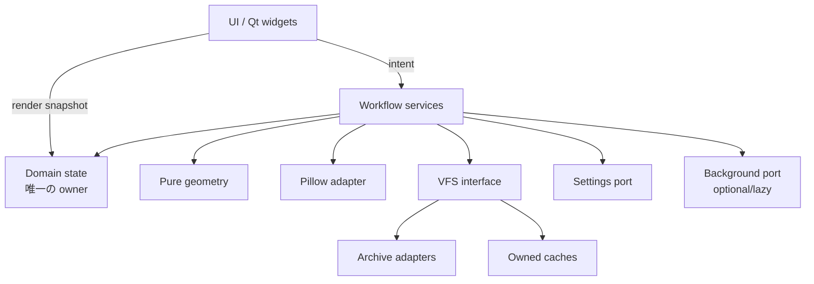

# リファクタリング監査

## 1. 監査の目的と前提

本書の目的は、PyQt6 製画像切り取りアプリの現在の挙動と UI を維持したまま、巨大化した `gazou_kiritori.py` を段階的に整理するための基礎資料を作ることである。ファイル分割自体ではなく、状態の所有者、座標系、依存方向、ライフサイクル、互換境界を明確にすることを主眼とする。

監査開始時点は次のとおりである。

| 項目 | 確認値 |
|---|---|
| リポジトリルート | `E:/application_project/gazou_kiritori` |
| ブランチ | `refactor/audit` |
| HEAD | `7f3a26f00382e91a413f1c3b464d631b55847c2c` |
| 開始前の作業ツリー | `git status --short` の出力なし |

本書では次の表記を使う。

- **事実**: コード、追跡ファイル、設定定義から直接確認できる。
- **リスク**: 事実から到達できる不具合の可能性。実際の再現有無は別途確認が必要な場合がある。
- **要確認**: 静的調査だけでは確定できず、実機・対応形式・操作シナリオでの確認が必要。
- **提案**: 将来の移行案であり、今回の監査では実装しない。

今回、実装コード、UI、依存関係、設定ファイル、Git 履歴には変更を加えていない。

## 2. 調査対象と調査方法

追跡対象全体を列挙し、特に以下を読んだ。

- `gazou_kiritori.py`: UI、状態、VFS、サムネイル、保存、ナビゲーションの本体
- `background_removal.py`: 背景除去モデル、キャッシュ検出、推論、解放
- `README.md`: 公開されている機能、操作、変更履歴
- `requirements_app.txt`、`requirements_bg.txt`: 実行時依存
- `.gitignore`、`.gitattributes`: 生成物・ローカル状態の扱い
- 起動・環境構築用バッチファイル: 起動経路と背景除去依存の導入方法

方法は、Git の状態確認、ファイル一覧・サイズ・行数の確認、`rg` による参照箇所検索、Python AST の読み取り専用解析、重要メソッドのコードレビューである。AST ではクラス・関数・メソッド範囲、例外ハンドラ、`getattr`/`hasattr`/`setattr`、主要属性の書き込み箇所を抽出した。アプリの GUI 操作、モデル推論、全形式のアーカイブ作成、保存によるファイル更新は実施していない。

## 3. 現在のリポジトリ構成

追跡ファイルは監査時点で 30 個である。主要構成は次のとおり。

| 対象 | 規模・役割 | 所見 |
|---|---|---|
| `gazou_kiritori.py` | 約 16,594 行、約 708 KiB | 低水準 VFS から MainWindow、全 UI、保存まで同居 |
| `background_removal.py` | 約 651 行、約 22 KiB | モデル検出、遅延バックエンド、推論、解放 |
| `README.md` | 約 201 行 | 対応機能と近年の状態同期修正を記録 |
| `requirements_app.txt` | Pillow、PyQt6、py7zr、rarfile | 通常アプリ側依存 |
| `requirements_bg.txt` | numpy、transformers、timm、kornia、huggingface_hub | 背景除去側依存。`torch` 自体はこのファイルに明記されていない |
| バッチファイル群 | 起動・依存導入補助 | Windows 前提の運用 |
| 画像・アイコン | UI 資産 | 本監査では内容変更なし |

追跡対象は、ルートの `.gitattributes`、`.gitignore`、`LICENSE`、`README.md`、
2 本の Python、2 本の requirements、起動/導入用 6 本の batch、`icons/` の 2 PNG、
`images/` の 14 screenshot PNG で構成される。実装を持つ package directory はなく、
アプリロジックはルートの 2 本の Python に集中している。

テストファイル、テスト設定、CI 定義は追跡ファイル内に見つからなかった。`config/settings.ini`、`hf_home`、`venv`、`__pycache__` 等はローカル/無視対象であり、設定値の存在確認だけを行い、利用者固有パスは本書に転記していない。

## 4. `gazou_kiritori.py` の全体構造

ファイルは概ね次の順序で積み上がっている。

| 行の目安 | ブロック | 主責務 |
|---:|---|---|
| 1–78 | import・定数・グローバルキャッシュ | Qt/Pillow/Torch/背景除去/VFS 依存の準備 |
| 80–950 | VFS・アーカイブ・画像 I/O・補助関数 | ZIP/RAR/7z、メモリ ZIP、画像キャッシュ、パス処理 |
| 952–3093 | 汎用/操作 UI クラス | スイッチ、ラベル、操作パネル、設定ダイアログ |
| 3095–5205 | `CropLabel` | 描画、選択、移動、リサイズ、ズーム入力、座標変換 |
| 5207–5880 | サムネイル非同期処理 | `QRunnable`、モデル、キャッシュ、世代ガード |
| 5883–6011 | `InfoBanner` | 中央情報表示 |
| 6013–16230 | `CropperApp` | 全画面構成、ワークフロー、状態同期、保存、ナビゲーション |
| 16232–16569 | 補助 UI/フィルタ | ショートカット、進捗、ツールチップ、トースト |
| 16571–16594 | エントリポイント | `QApplication` と `CropperApp` の生成・実行 |

**事実:** `CropperApp.__init__` だけで約 1,764 行あり、`CropperApp` 全体は約 10,218 行である。責務の集中だけでなく、同じクラス内に「状態を決める処理」「UI を更新する処理」「ファイルを書き出す処理」が混在していることが移行時の主な難所である。

## 5. 主要クラスと責務

| クラス | 責務 | 主な入力 | 出力・副作用 | 依存/重要状態 | 重要度 |
|---|---|---|---|---|---|
| `CropperApp` | MainWindow、全ワークフローの調停 | UI 操作、パス、モデル選択、矩形通知 | UI 更新、画像/設定/ファイル更新、画面遷移 | Qt、Pillow、VFS、`CropLabel`、`ThumbnailListModel`、背景除去 | 最重要 |
| `CropLabel` | 画像表示上の直接操作と座標変換 | マウス/キー/ホイール、画像・表示寸法 | 矩形状態更新、描画、Signal、MainWindow 直接更新 | `mainwin`、画像座標矩形、パン、ズーム、調整状態 | 最重要 |
| `ThumbnailListModel` | フォルダ/画像一覧と非同期サムネイル | VFS パス一覧、Qt role、世代番号 | ワーカー投入、モデル更新 Signal、PNG キャッシュ | グローバル `QThreadPool`、VFS、Pillow | 高 |
| `_ThumbTask` | 画像サムネイル生成の実行 | モデルの bound method と row | `_generate_thumb(row)` 呼び出し | モデルの可変状態 | 高 |
| `_DirOverlayTask` | フォルダ代表画像の非同期合成素材生成 | model、row、path、generation | PNG bytes の Signal | VFS、Pillow、世代番号 | 高 |
| `SevenZipCompat` | py7zr を ZipFile 風に見せる | 7z パス | `namelist/getinfo/open/close` | py7zr、内部索引 | 高 |
| `ActionPanel` | 保存・調整・取消の操作パネル | Signal 接続、ドラッグ | MainWindow の detached 状態を直接変更 | 親の `mainwin` 実装 | 中 |
| `NudgePanel` / `MovableNudgePanel` | 辺単位調整、比率固定、移動可能 UI | nudge callback、MainWindow | `CropLabel` 状態参照、MainWindow へのイベント転送 | private 状態と設定 | 中 |
| `CustomListView` | サムネイル上のキー処理 | キーイベント | MainWindow の private navigation 呼び出し | `mainwin` | 中 |
| `BackgroundRemovalManager` | 背景除去バックエンド所有 | モデルキー、Pillow 画像 | RGBA 画像、モデルロード/解放 | Torch、Transformers、モデルキャッシュ | 高 |

`CustomListView` は `mainwin` を受け取れるが、`CropperApp.__init__` の生成箇所は `CustomListView()` であり、後から `mainwin` を設定するコードも見つからない。したがって `CustomListView.keyPressEvent` の Ctrl+左右にある `_prepare_preserve_for_nav` / `_move_thumb_focus` は現在の生成経路では呼ばれないとコード上は読める。実操作で別経路がないかは要確認である。

## 6. 主要関数と責務

| シンボル | 責務 | 入出力/副作用 | 主な呼び出し先・依存 |
|---|---|---|---|
| `_sig_for` / `_cache_get` / `_cache_put` | 画像キャッシュの同一性確認と LRU 更新 | パスから signature、Pillow 画像を保持 | OS stat、アーカイブ entry metadata |
| `make_zip_uri` / `parse_zip_uri` | VFS URI の生成・分解 | 物理/`memzip:*` と inner path の相互表現 | 文字列規約 |
| `_open_zip_cached` | ZIP/RAR/7z/メモリ ZIP を統一して開く | live archive object を LRU 保持 | zipfile、rarfile、py7zr、BytesIO |
| `vfs_listdir` / `vfs_parent` | 仮想ディレクトリの列挙・親移動 | `{name, uri, is_dir}` の列 | アーカイブ索引、メモリ ZIP 登録 |
| `open_bytes_any` / `open_image_any` | 通常/VFS 画像のロード | bytes / EXIF transpose 済み Pillow 画像 | `_open_zip_cached`、Pillow |
| `make_fixed_thumbnail_any` | サムネイル生成 | PNG bytes | VFS、Pillow |
| `CropLabel.image_to_label_coords` / `label_to_image_coords` | 現在画像と表示ウィジェット間の変換 | 整数座標 | base display、zoom、viewport、offset |
| `CropperApp.open_image_from_path` | 画像切替と状態復元 | image path、UI 状態スナップショット | VFS、Pillow、`show_image`、複数の復元 helper |
| `CropperApp.open_folder` | 物理/VFS フォルダ遷移 | directory URI | VFS、モデル reset、履歴、遅延選択 |
| `CropperApp.show_image` | 画像表示と viewport 構築 | `self.image` と zoom/pan | QImage/QPixmap、`CropLabel` |
| `CropperApp.save_cropped` | 単画像保存の全経路 | 矩形・画像・保存設定 | Pillow save、copy2、mkdir、状態復元 |
| `CropperApp.on_batch_crop_clicked` | 一括変換・保存 | 現在の操作履歴と一覧 | VFS、Pillow、進捗 UI、保存名 helper |
| `CropperApp._prepare_preserve_for_nav` | 次画像へ渡す状態の構築 | 現在の矩形/モード | `_nav_chain_state`、one-shot preserve |
| `CropperApp.remove_background_on_current_image` | 背景除去の UI ワークフロー | 現在画像・矩形 | `BackgroundRemovalManager`、画像/矩形再初期化 |

## 7. グローバル状態とキャッシュ

主要定数は `APP_NAME`、`APP_VERSION`、`IMAGE_EXTS`、`ARCHIVE_FILE_EXTS`、`ARCHIVE_EMBED_EXTS`、`DEBUG_VIEW_RECT`、`LOG_ENABLED` である。`ARCHIVE_EMBED_EXTS` は ZIP/CBZ のみであり、ネストを一般化した定義ではない。

| 状態 | キー | 値 | 所有者/制限 | 無効化・終了処理 | リスク |
|---|---|---|---|---|---|
| `_IMG_CACHE` | `norm_vpath(path)` | `{sig, img}` | モジュール、最大 8 | LRU eviction のみ | 明示 clear なし。Pillow image の寿命が暗黙的 |
| `_MEM_ZIP_BYTES` | `memzip:N` | 埋込 ZIP 全 bytes | モジュール、無制限 | なし | 大きいネスト ZIP を開くたびメモリ保持 |
| `_MEM_ZIP_META` | `memzip:N` | outer/inner metadata | モジュール、無制限 | なし | 外側更新後も同じ文字列なら古い bytes 再利用 |
| `_open_zip_cached` | decorator 呼出し時の path 引数 | live archive object | `lru_cache(maxsize=8)` | explicit close/clear なし | path 表記差、更新、handle 寿命 |
| `_zip_index_lower` | archive object | lowercase→実名 map | `lru_cache(maxsize=32)` | explicit clear なし | 大文字小文字だけ異なる entry が衝突 |
| `ThumbnailListModel._cache` | 正規化 path | `(signature, PNG bytes)` | model instance、無制限 | invalidate は個別、reset で clear しない | フォルダをまたいだメモリ増加、`sig=None` 再利用 |
| `_folder_overlay_cache` | physical norm path / `VFS::URI` | 代表画像 path | `CropperApp`、無制限 | force 時の単一 key pop | VFS 候補の存在再検査なし |
| scaled/preview/checker caches | 表示条件 | QPixmap/QImage/QBrush | `CropperApp` | 条件変化で置換 | 小さく、有界に近い |

`ThumbnailListModel` のクラス属性 `_cache = {}` は `__init__` で instance `_cache` に上書きされるため、共有キャッシュではない。定義と実際の所有者が食い違う dead/misleading state である。

## 8. 主要コンポーネントの依存関係

### 依存表

| 起点 | 終点 | 種別 | 具体例 |
|---|---|---|---|
| `CropperApp` | `CropLabel` | 所有・直接呼出し | `label.fixed_crop_rect_img`、`set_adjust_mode`、座標変換 |
| `CropLabel` | `CropperApp` | private 直接アクセス | `_crop_rect_img`、`_crop_rect`、`_hide_action_panel`、`_schedule_preview` |
| `CropLabel` | `CropperApp` | Qt Signal | `selectionMade→on_crop`、`fixedSelectionMade→on_fixed_crop_move`、`movedRect→on_crop_rect_moved` |
| `CropperApp` | `ThumbnailListModel` | 所有・直接呼出し | `reset_items`、`invalidate_path`、一覧同期 |
| worker | model/UI thread | Qt Signal | `thumbReady`、`dirOverlayReady` |
| `CropperApp` / model | VFS | 関数呼出し | list/open/parent/display name |
| VFS | archive libraries | 外部依存 | zipfile、rarfile、py7zr |
| `CropperApp` | Pillow/FS | 外部依存 | load、transform、crop、save、copy2、delete |
| `CropperApp` | settings | 所有・永続化 | `QSettings(config/settings.ini)` |
| `CropperApp` | background manager | 遅延インスタンス所有 | remove、set_model。ただし終了 dispose なし |

### Mermaid



実線は所有/呼出し、点線は Signal、太線は private 実装への逆向き依存を表す。最も重要なのは、`CropperApp→CropLabel` だけでなく `CropLabel→CropperApp` にも状態更新が戻る循環である。

## 9. 状態の所有者

現行コードから読み取れる authoritative state は一枚岩ではない。操作ごとの優先順位が実質的な正を決めている。

| 状態 | 現在の主所有者 | authoritative と読める値 | 他の写し/派生 | 同期漏れ時の影響 | 集約先候補 |
|---|---|---|---|---|---|
| 現在画像 | `CropperApp` | `self.image`（EXIF/回転/反転/BG 適用後） | `img_qt`、`img_pixmap`、scaled/preview cache | 表示と保存内容の不一致 | `ImageSession` |
| 自由矩形 | `CropLabel` と `CropperApp` | 通常は `label.drag_rect_img` / `_crop_rect_img` | `_crop_rect`（label 座標）、legacy `drag_rect` | 保存、preview、panel の不一致 | `CropState.rect_img` |
| 固定矩形 | `CropLabel` | `fixed_crop_rect_img` | `fixed_crop_rect_img_base`、`fixed_crop_size`、legacy `fixed_crop_rect` | ナビ復元、表示、保存サイズ差 | `CropState` |
| 表示矩形 | 両者 | `_crop_rect` は派生値のはず | 各 paint helper が再計算する QRect | 1px ずれ、panel 位置ずれ | 保存せず ViewProjection から計算 |
| zoom | `CropperApp` | `zoom_scale` | label の geometry が参照 | pan/viewport 再計算差 | `ViewState` |
| base 表示寸法 | `CropperApp` | `base_display_width/height` | QPixmap size | resize 後の変換差 | `ViewState` |
| pan/viewport | `CropLabel` | `_pan_offset_x/y` と `_view_rect_scaled` | `_init_offset_x/y` | crop hit-test と描画差 | `ViewState` を単独所有 |
| 調整モード | 両者 | `CropperApp._adjust_mode` と `CropLabel.adjust_mode` を手同期 | panel/nudge visibility | UI の片側だけ有効 | `CropState.mode` |
| aspect lock | `CropLabel` | `_aspect_lock/_aspect_ratio/_aspect_base_wh` | NudgePanel 表示 | resize 比率と表示差 | `CropState.aspect` |
| 画像外禁止 | `CropperApp` 設定 | `constrain_crop_to_image` | label が mainwin から参照 | drag/restore 時だけ補正差 | immutable settings + geometry input |
| resize 中の辺 | `CropLabel` | `_resize_handle` 等 | anchor/base rect/edge lock | ドラッグ方向反転時の跳び | gesture-local state |
| 選択画像 | `CropperApp` | `image_path` と `current_index` | `image_list`、model list、QModelIndex | 誤画像 preview/save/delete | `NavigationState` |
| 選択 thumbnail | QListView/model | `currentIndex()` | path で `current_index` と照合 | highlight と中央画像差 | path identity を唯一のキーに |
| ナビ引継ぎ | `CropperApp` | `_nav_chain_state` + `_preserve_ui_on_next_load` | snapshot/post-save fields | 前後移動で枠が消失/二重復元 | versioned `CarryState` |
| 背景モデル | `CropperApp` / settings | `bg_model_key` | `bg_manager.model_key` | UI 選択とロード済み backend 差 | `BackgroundService` |
| 保存先 | `CropperApp` / settings | `save_dest_mode` と `save_custom_dir` | 実効 `save_folder` | 表示先と実保存先差 | `SavePolicy` |

回転・水平反転・垂直反転は独立した boolean/state ではなく、現在の `self.image` へ破壊的に適用される一方、一括処理向けには `_batch_transform_ops` に履歴が保存される。単画像の状態と一括用レシピが別表現である。

「100%」は `zoom_scale == 1.0`、すなわちウィジェットへ fit した `base_display_width/height` に対する 100% である。元画像 1 pixel = 画面 1 pixel を表す専用状態・特別分岐ではない。

## 10. 重複している状態

### 矩形

`save_cropped` は固定矩形、`_crop_rect_img`、引数 `rect` の label→image 逆変換の順で採用する。つまり、同じ選択領域の写しが不一致になった場合、画面に見えている `_crop_rect` ではなく別の image rect が保存され得る。`on_crop`、`on_fixed_crop_move`、drag/resize/keyboard、rotation/flip、constraint、cancel、open restore がそれぞれ複数属性を書き換える。

`fixed_crop_rect_img_base` はナビゲーション用基準として current rect と意図的に分けられ、一部の回転・反転で更新しない設計になっている。この互換挙動は単純に統合してはならず、「現在画像上の rect」と「次画像へ渡す template rect」を別型で明示する必要がある。

### 表示・view

`_view_rect_scaled` と `_pan_offset_x/y` は `show_image` と `CropLabel._recalc_pixmap_offsets` の双方が更新する。`_crop_rect` は派生できる label 座標なのに保存され、直接上書きされる。`drag_rect`、`drag_origin`、`fixed_crop_rect`、`zoom_mode` は書き込みに比べ読み取りが見つからず、legacy state の可能性が高い。

### UI mode

`CropperApp._adjust_mode`、`CropLabel.adjust_mode`、`ActionPanel` の adjusting 表示、Nudge overlay visibility が手続き的に同期される。`_snapshot_adjust_state` は矩形そのものを含まず、`_restore_adjust_state` は戻り値を返さない。一方 `open_image_from_path` の `_try_restore` はその戻り値を truthy/falsey で判定するため、常に manual fallback に進む。現挙動を壊さず整理するには、この二段復元をまずテストで記録する必要がある。

### 選択と保存設定

現在画像には path、image-only index、browser model row、QModelIndex の少なくとも四表現がある。フォルダ row が混じるため index を直接共用できず、複数箇所で path 検索している。

保存設定は起動時に `save_dest_mode/save_custom_dir` を読み、途中で `save_folder=None` に再初期化し、UI 作成時の toggle と末尾の適用処理で戻す。最終的には機能している経路があるが、中間状態と複数 writer が多く、UI 組み立て順に依存している。

## 11. 座標系と座標変換

### 座標系

| 座標系 | 表現 | 変換/使用箇所 | 注意点 |
|---|---|---|---|
| ファイル原画像 | VFS から decode した Pillow image | `open_image_any` | EXIF transpose 後は同じ寸法とは限らない |
| 現在画像ピクセル | `self.image`、image QRect | crop/transform/save の基準 | 回転・反転・BG 適用後。immutable original ではない |
| base 表示 | `base_display_width/height` | `show_image` | label に fit した寸法 |
| full scaled 表示 | base × `zoom_scale` | `_current_geometry` | zoom 後の仮想 pixmap |
| viewport | `label._view_rect_scaled` | `show_image`、pan | full scaled の切り出し領域 |
| widget/label | `_init_offset_x/y` を加えた座標 | mouse、paint、panel | viewport を中央配置したローカル座標 |
| 保存矩形 | `(left, top, right, bottom)` | Pillow `crop` | right/bottom は半開区間 |
| preview | `_ensure_preview_base` で縮小した画像座標 | `update_preview` | source rect を preview scale で写像 |



`image_to_label_coords` は現在画像座標を full scaled 座標へ倍率変換し、viewport 原点を引き、中央 offset を足して `round` する。`label_to_image_coords` はその逆を `round` する。単独の変換オブジェクトではなく、MainWindow と label の可変属性を参照する。

### 境界と右端/下端

保存は `x + width` / `y + height` を exclusive edge として Pillow へ渡し、回転・反転も `W - (x + w)` など半開矩形として整合している。一方 Qt `QRect.right()/bottom()` は inclusive edge である。

コードには次の混在がある。

- `_imgrect_to_labelrect` は `left/top` と `right/bottom` を変換して差の絶対値を幅・高さとし、`+1` しない。
- open restore や一部 move/keyboard 経路は同じ変換後に `+1` する。
- fixed/drag の描画 helper には `left + width` / `top + height` を使う経路がある。
- resize 経路には `right/bottom` を直接使う箇所がある。
- `_clamp_point_to_image` は drag の exclusive edge として `x == width`、`y == height` を許す一方、`_crop_image_bounds` は `QRect(0,0,w,h)` の inclusive semantics を持つ。

**リスク:** 同一の image QRect が操作経路により 1 pixel 異なる label QRect になり、hit handle、サイズ表示、preview、復元後の panel 位置に差が出る可能性がある。保存 box 自体は image-space rect が正しく同期されている限り半開表現で一貫するが、表示から逆算する fallback では差が保存範囲へ波及し得る。

100% 表示専用の座標変換はない。label resize で base fit が変わるため、同じ `zoom_scale=1.0` でも画面上の pixel scale は変わる。

## 12. 子ウィジェットと MainWindow の結合

| 参照元 | 参照先 | 目的 | 置換候補 | 互換リスク |
|---|---|---|---|---|
| `CropLabel` | `mainwin._crop_rect_img/_crop_rect` | drag/resize/keyboard の即時同期 | `CropController.update_rect()` または state owner | Signal の順序、preview timing |
| `CropLabel` | `_hide_action_panel`、`_compute_action_panel_pos`、`_position_nudge_overlay*` | overlay 操作 | `selectionInteraction` Signal + UI coordinator | drag 中の表示タイミング |
| `CropLabel` | `_schedule_preview`、`safe_update_preview`、`update_crop_size_label` | preview/size 更新 | rectChanged Signal 一本化 | 発火頻度と debounce |
| `CropLabel` | `mainwin.image/img_pixmap/zoom_scale` | geometry と pan | 明示的 `ViewTransform` input | resize/zoom 中の整合 |
| `CropLabel` | `mainwin.pan_image/toggle_action_panel/zoom_*` | 入力を親へ転送 | intent Signals | key/mouse acceptance |
| `ActionPanel` | `parent().mainwin._action_panel_detached` | 手動移動を記録 | `panelMoved` Signal | overlay 再配置条件 |
| `NudgePanel` | `mainwin.label._aspect_*`、`set_aspect_lock` | 比率 UI 同期 | `CropState` view-model | ボタン表示と基準値 |
| `MovableNudgePanel` | `mainwin._nudge_detached/settings/label` | detach 永続化、key 転送 | Signals と settings service | shortcut focus |
| `CustomListView` | `_prepare_preserve_for_nav/_move_thumb_focus` | Ctrl+左右 navigation | `navigateRequested(delta)` Signal | 現状 `mainwin=None` の挙動を要記録 |

AST 集計では `gazou_kiritori.py` に `getattr` が 627、`hasattr` が 199、`setattr` が 8 箇所ある。すべてが結合問題ではないが、MainWindow 初期化順や互換用 optional attribute を正常系として扱う傾向を示す。置換は signal 化だけを先行させず、まず状態の owner と発火順を固定する必要がある。

## 13. 例外処理と不整合を隠す可能性

AST で `gazou_kiritori.py` の exception handler は 553 個、そのうち `except Exception` は 532 個、handler 直下に `pass` を持つものは 317 個、`raise` を持つものは 1 個であった。bare `except:` はなかった。`background_removal.py` は handler 19、`except Exception` 18、handler 直下の `pass` 6、`raise` 6（うち引数なし再送出 2）である。

### 妥当性別の評価

| 分類 | 例 | 評価 |
|---|---|---|
| 意図的な機能降格 | rarfile/py7zr/Torch import、DWM dark titlebar | アプリを起動可能に保つ意図は妥当。例外型と capability 状態の明示が望ましい |
| UI cleanup | overlay close、Qt object 生存確認、tooltip cleanup | 終了/破棄競合を避ける保護として妥当なものが多い |
| preview/thumbnail placeholder | decode 失敗時の代替表示 | 回復方針は妥当。path と例外を構造化ログへ残すべき |
| load/navigation restore | `open_image_from_path`、`open_folder` 内の多数の broad catch | 部分的に状態だけ更新された不整合を隠す可能性が高い |
| save 後の reopen | `save_cropped` の open/state restore を catch して成功を返す | ファイル保存成功と UI 復元失敗が区別されず、ユーザーに部分失敗が伝わらない |
| background manager 切替 | manager を `None` にするだけの経路 | backend 解放失敗/未実行を隠す。明示 dispose API が必要 |

`LOG_ENABLED=False` が既定であり、`pass` の多くはログも残さない。そのため「クラッシュしない」代わりに表示だけが古い、panel だけ消える、選択だけずれるというソフトな不整合を追跡しにくい。

改善は一括で例外を削るのではなく、境界ごとに行うべきである。

1. VFS/codec/FS 境界は想定例外型へ限定し、失敗 path と operation を返す。
2. UI cleanup は best-effort のまま debug log を統一する。
3. invariant 内部処理は `None/hasattr` を正常化せず、テスト環境では assert、実運用では error state へ変換する。
4. 保存は `SaveResult(file_written, ui_reloaded, warning)` のように部分成功を表現する。

## 14. VFS、圧縮ファイル、キャッシュのライフサイクル

### 経路

通常 path と `zip://<archive>!/<inner>` を同じ API へ載せる。ZIP/CBZ は `zipfile.ZipFile`、RAR/CBR は `rarfile.RarFile`、7z/CB7 は `SevenZipCompat` を使う。ZIP 内 ZIP/CBZ だけは entry bytes 全体を `_MEM_ZIP_BYTES` へ登録し、`memzip:N` を外側 archive path の代わりに URI へ埋める。

`vfs_listdir` は noise entry を除外し、仮想 child を合成する。`vfs_parent` は inner path を一段戻し、memzip root では `_MEM_ZIP_META` の outer/inner へ戻る。`_zip_index_lower` は case-insensitive resolve を行うが、case だけ異なる entry を単一 map key に畳む。

### 確認できたライフサイクル上の論点

- `_open_zip_cached` は live archive object を最大 8 個保持するが `cache_clear()`、close-all、MainWindow の `closeEvent` はない。エントリポイントも終了処理を呼ばない。
- decorator key は関数内で正規化する前の引数なので、同じ物理 archive の path 表記差が別 cache entry になり得る。
- archive ファイルを同名置換しても、open object と lowercase index に mtime/size を含む invalidation はない。
- `_MEM_ZIP_BYTES/_META` は無制限、clear なし、outer signature なしである。同じ outer/inner 文字列は古い bytes を再利用する。
- `SevenZipCompat` は `open` を備えるが `read` を備えない。`open_bytes_any` と `_register_mem_zip` は `zf.read(inner)` を呼ぶため、7z の direct bytes path や 7z 内埋込 ZIP は同じ抽象としては動かない。Pillow の `open(file-like)` fallback で通常画像が読める経路はある。
- `vfs_is_file(zip_uri)` は主に URI と拡張子を見ており、archive entry の実在を毎回検証しない。削除/置換後の stale URI を file と判定し得る。
- RAR は `rarfile` に加えて外部展開コマンドの可用性に依存し得る。環境差は要確認。
- 一時展開ディレクトリは使わず、画像と nested ZIP はメモリ上で処理される。

### 削除・フォルダ変更・終了

物理画像の削除では thumbnail cache の個別 invalidation/リスト再構成があるが、archive cache、image cache、folder overlay cache 全体は消さない。フォルダ変更時も model generation は進むが model PNG cache は温存する。アプリ終了時の explicit worker wait、archive close、memzip clear、background dispose は見つからない。

## 15. 非同期サムネイル処理

`ThumbnailListModel.data` が decoration を要求された時点で `_ThumbTask(self._generate_thumb, row)` または `_DirOverlayTask(model,row,path,gen)` を `QThreadPool.globalInstance()` へ投入する。結果は PNG bytes として Signal で UI thread の `_apply_thumb/_apply_dir_overlay` へ戻り、そこで QPixmap を生成する。

| 事象 | guard/処理 | 残るリスク |
|---|---|---|
| 別フォルダ/別 archive | `reset_items` で `_gen += 1`、pending clear、global pool `clear()` | running task は止まらない。global pool clear は他用途の queued runnable も消す |
| model reset | row/path/gen を `_apply_*` で検証 | `_ThumbTask` は path/gen を submit 時に capture せず、run 時に可変 model から読む |
| 現在画像削除 | `remove_paths`、row/path 再照合 | running old task は継続、同 path が残る場合は cache/結果が再利用され得る |
| 複数画像削除 | 公開 UI の一括削除は見つからない。model API は複数 path を受ける | row shift 中の task は path check で多くを破棄するが、余分な処理は残る |
| 並べ替え/row 変更 | `_apply_thumb` が row/path を確認し、必要なら path を再検索 | 同名/同 URI identity の前提。submit 時 snapshot 不在 |
| app 終了 | Qt global pool の process lifetime に依存 | 明示 cancellation token、waitForDone、model disposing flag がない |

`_DirOverlayTask` は path と generation を constructor で capture し、複数段階で比較するため `_ThumbTask` より堅牢である。画像 task も `(path, signature, generation, requested_size)` を immutable job input にし、結果適用だけを model が判断する構造が望ましい。

## 16. 保存処理

### 単画像

入口は ActionPanel/shortcut の `do_crop_save`、実処理は `save_cropped` である。矩形は固定 rect→`_crop_rect_img`→label rect 逆変換の優先順で決め、画像境界へ clamp して Pillow の半開 crop box を作る。

| 経路 | ファイル名/保存先 | 書出し | 成功後状態 | 失敗時 |
|---|---|---|---|---|
| 連番 | `<base>_cropped_001..999.<ext>`、custom または source dir | Pillow save。ただし全体+lossy+同 ext は `copy2` | last saved size 更新、上位処理で navigation | `False,error`。空きなしも error |
| 上書き | `<base>.<ext>` | Pillow save または `copy2` | 同一 source dir なら snapshot、saved path reopen、thumb invalidate | write error は `False`。reopen/restore error は swallow され成功 |
| archive source | archive と同じ物理フォルダまたは custom | archive 自体は変更せず通常ファイルを作る | 出力 path を開く場合あり | archive read error を返す |
| alpha/BG | alpha があれば設定の PNG/WebP へ強制 | format 別 save kwargs | 画像 state は current RGBA | metadata/codec の実機確認要 |

上書き確認ダイアログは `save_cropped` の個別経路にはない。`overwrite_mode` の明示的な UI 選択を確認とみなす設計である。

### 重要な保存リスク

`save_cropped` は「全体を覆う、JPEG/WebP、元と同じ拡張子」の場合、再圧縮回避のため `self.image_path` を `copy2` する（行 13671–13680、13800–13809）。しかし回転/反転は `self.image` を既に変換し（`on_flip_horizontal`、`on_flip_vertical`、`_rotate_90_common`）、全体 crop はその変換後画像に対して判定される。

**リスク:** 変換後の全体保存で original file を copy し、画面上の変換を出力へ反映しない。上書き先が source 自身なら copy すらせず成功表示へ進む。これは静的コード上の具体的な整合性問題であり、最優先の regression test が必要である。

加えて書き込みは temp+atomic replace ではなく宛先へ直接行う。プロセス停止や codec error 時の既存ファイル保護は限定的である。

### 一括

`on_batch_crop_clicked` は current image の transform operation list を各画像へ適用し、現在矩形の比率等から crop して UI thread 上で順次保存する。`processEvents` を呼ぶため、長時間処理中の reentrancy を要確認。

`_resolve_batch_save_root` は zip URI を `parse_zip_uri` 後、`dirname(zp) or "."` とする。`zp == "memzip:N"` では `"."`、すなわち current working directory になる。一方、単画像用 `_get_image_source_dir` は `_MEM_ZIP_META` を外側物理 archive までたどる。nested ZIP の一括保存先だけ規則が異なる。

archive 内の異なる inner directory に同じ basename がある場合、`_build_batch_output_path` は directory 構造を保持せず同じ save root に出す。上書きモードでは衝突し得る。連番モードでは別名化されるが source 対応は失われる。

## 17. ナビゲーションと状態遷移

browser list は folder/archive/image を含む一方、`image_list/current_index` は image のみである。QListView row と image index は一致しないため、`_sync_thumb_selection`、`on_thumbnail_clicked`、`_preview_from_thumb_index` 等が path で相互変換する。

`open_folder` は `_nav_epoch` を増加し、model reset、履歴、last-focus、初期選択、80ms 相当の遅延処理、保存先 prompt を調停する。`_preview_from_thumb_index` には同一 file/一覧 scan の類似ブロックが複数あり、分岐ごとの状態差が見えにくい。

前後画像への状態引継ぎは以下の二系統である。

- `_preserve_ui_on_next_load`: 次回 load 一回向け
- `_nav_chain_state`: 前後 navigation をまたいで保持

さらに post-save 専用に `post_save_overlay_rect_img`、`post_save_preview_rect_img`、`post_save_original_fixed_rect_img`、`post_save_fixed` が加わる。`_suspend_chain_clear` 等の guard もあり、load 開始時の reset と load 後の復元が複数 pass で行われる。

削除は物理 current file のみで、archive entry は削除しない。削除後は folder を再読込し、次/前候補を選び直す。途中の VFS/file 判断が stale だった場合、selection と中央表示がずれる可能性がある。

`open_folder` の遅延保存 prompt guard は `os.path.abspath` を VFS URI にも適用する。文字列比較 guard として同じ変換なら働き得るが、URI を filesystem path として扱う設計は明示的 identity 関数へ置き換えるべきである。

## 18. 背景除去と通常起動の依存関係

`gazou_kiritori.py` は Qt import 前のトップレベルで `torch` を import し、成功/失敗を常に print する。続いて `background_removal.py` の `BackgroundRemovalManager/get_available_bg_models` もトップレベル import する。`background_removal.py` 自身の重い Torch/Transformers import は backend の load/remove/close 内へ寄せられているが、Main module 側の eager Torch import により通常切り取りだけの利用者も Torch の DLL/import cost と失敗経路の影響を受ける。

依存未導入時はトップレベル Torch import error を catch してアプリは継続し、背景除去ボタン操作時の manager 初期化/推論失敗を warning にする。背景除去 requirements に `torch` が直接列挙されていないため、バッチによる環境構築を含む実際の導入契約は別途確認が必要である。

`BackgroundRemovalManager` は backend を遅延生成し、CUDA が使えれば自動選択する。モデル切替の `set_model` は `_dispose_backend` を通る。一方、MainWindow の `_set_bg_model_key` は `self.bg_manager=None` とするだけで、旧 manager/backend の明示 close を呼ばない。`change_background_model` は manager の `set_model` を使うため、二つの UI 経路で解放 semantics が異なる。

アプリ終了時にも manager dispose は見つからない。backend close 自体は CPU move、GC、CUDA cache clear を実装しているため、owner から確実に呼ぶ public `close()` と MainWindow lifecycle が不足している状態である。

背景除去推論と一括処理は UI thread で同期実行される。wait cursor は出るが、大きい画像/モデルでは UI 応答停止が起き得る。完全遅延ロード化では、起動時ボタン可用性・モデル cache 検出・既存のエラーメッセージ・CUDA 初期化タイミングを characterization test/manual test で固定する必要がある。

## 19. テスト可能な純粋処理

| 候補 | 現在位置 | 現在の外部状態 | 純粋化 input→output | 境界条件/characterization |
|---|---|---|---|---|
| QRect normalization/clamp | `CropLabel._adjust_existing_rect_into_image` 等 | Qt QRect、mainwin setting/image | Rect、image size、policy→Rect+clipped | negative、zero、完全外、edge 接触 |
| aspect resize | `_clamp_aspect_resize_rect` | handle/anchor/label fields | base rect、handle、point、ratio、bounds→Rect | handle cross、1px、ratio extreme |
| edge resize | `_clamp_edge_resize_rect` | label state | rect、edge、delta、bounds→Rect | inverted edge、out-of-bounds |
| image↔label | `image_to_label_coords` / inverse | image/base/zoom/viewport/offset | `ViewTransform`+point→point | round trip、非整数 scale、100%/8x |
| rotate/flip rect | transform methods | `self.image` と複数 rect slots | image size、Rect、operation→new size/Rect | edge、full image、4 rotations |
| pan/viewport | `show_image` / `pan_image` | widget/pixmap fields | base、zoom、viewport size、pan→viewport | one dimension smaller、resize |
| save box | `save_cropped` | label/MainWindow state | rect、image size→clamped half-open box | partial outside、empty、full |
| carry state | `_prepare_preserve_for_nav` | many UI fields | CropState+event→CarryState | fixed/free、save/delete、constraint |
| output name | `_output_name_from_image_path` | `image_path`、VFS globals | source identity→basename | physical、ZIP、nested ZIP、Unicode |
| sequence name | `save_cropped` / `_build_batch_output_path` | filesystem existence | base/ext/existing set→path | 001–999、case-insensitive FS |
| VFS URI parse | `make_zip_uri/parse_zip_uri/norm_vpath` | OS path normalization | path/inner→typed identity | `!`, slash、drive、memzip |
| archive index key | `_zip_index_lower` | live object | entry names→resolver | case collision、directory marker |
| cache signature | `_sig_for` | FS/archive metadata | identity+metadata→signature | replace same size/time、missing |

最初は既存 private method を直接呼ぶ characterization test でよい。期待仕様を新しく決める unit test と、現在挙動を記録する test を分け、確認済み defect は `expectedFailure` 等で「現状を固定すべき挙動」と誤認しないようにする。

## 20. 不具合が起きやすい状態遷移



特に危険な境界は次である。

1. drag/resize 中: `CropLabel` と MainWindow の rect、panel、preview を同時更新する。
2. rotation/flip 後: current image、三種の rect、batch operation history、base fixed rect の更新方針が異なる。
3. save 成功後: file write は成功しても reopen/restore が失敗し得るが、成功結果は同じ。
4. prev/next: load 前 reset、one-shot state、chain state、manual fallback restore が重なる。
5. delete: filesystem、browser rows、image-only index、running thumbnail task を同時に変える。
6. folder/archive switch: generation は変わるが global worker、archive/cache lifecycle は継続する。
7. background model switch/exit: backend owner reference は消えても dispose が保証されない。
8. full-cover transformed save: current image ではなく source file copy が選ばれ得る。

## 21. 優先度付きの問題一覧

静的監査だけで **Critical** と断定できる項目はなかった。データ消失・任意コード実行・常時起動不能を確認したわけではないためである。ただし H-01 は保存成功と出力内容の不一致がコード上で具体的に成立し、最優先で検証すべき High とする。

| ID | 問題 | 重要度 | 発生可能性 | 影響範囲 | 対応段階 |
|---|---|---|---|---|---|
| H-01 | 変換後の全体保存が元ファイル copy を選ぶ | High | 高 | 単画像の上書き・連番、JPEG/WebP | 1、5 |
| H-02 | crop state の複数 owner と優先順位依存 | High | 中〜高 | 選択、調整、preview、保存、復元 | 1、4、6 |
| H-03 | QRect inclusive edge と保存 half-open edge の混在 | High | 中 | 1px 境界、resize、復元、保存 fallback | 1、4 |
| H-04 | 保存後 UI 復元の部分失敗が成功扱い | High | 中 | 上書き、同一 source dir | 1、5 |
| H-05 | archive/memzip cache の invalidation・close 不在 | High | 中 | 更新された archive、長時間利用、終了 | 1、3 |
| H-06 | nested ZIP 一括保存先が current working directory | High | 高（当該入力） | ZIP 内 ZIP の一括保存 | 1、5 |
| M-01 | thumbnail job が submit 時 path/gen を固定しない | Medium | 中 | 高速な folder switch/delete/reset | 1、3/6 |
| M-02 | global thread pool clear と終了 lifecycle 不在 | Medium | 中 | 非同期処理、将来の他 worker | 1、3/6 |
| M-03 | broad exception による silent partial state | Medium | 高 | load、navigation、save、overlay | 1、2、以降全段階 |
| M-04 | 背景モデル解放経路の不一致と eager Torch | Medium | 高 | 起動、model switch、終了、VRAM | 1、8 |
| M-05 | archive entry の case collision | Medium | 低〜中 | case-sensitive 名を含む archive | 1、3 |
| M-06 | 一括保存 basename 衝突 | Medium | 中 | archive 内の同名画像、overwrite | 1、5 |
| M-07 | direct write で atomicity がない | Medium | 低〜中 | 上書き保存、異常終了/容量不足 | 1、5 |
| M-08 | `CustomListView` の `mainwin=None` | Medium | 高（現生成経路） | Ctrl+左右 thumbnail navigation | 1、7 |
| M-09 | 同名メソッド再定義による dead behavior | Medium | 高 | overlay、保存先リンク、保守変更 | 1、2/9 |
| L-01 | legacy/misleading state と重複 helper | Low | 高 | 可読性、誤修正 | 2、9 |
| L-02 | debug/optional import の stdout と契約不明 | Low | 高 | 起動ログ、配布時診断 | 2、8 |

### 個別根拠・対応

#### H-01 変換後の全体保存が元ファイル copy を選ぶ

- **根拠:** `CropperApp.save_cropped` 行 13671–13680/13800–13809 は full-cover lossy same-extension で `shutil.copy2(self.image_path, ...)`。`on_flip_horizontal`、`on_flip_vertical`、`_rotate_90_common` は `self.image` を変換する。
- **起こり得る不具合:** 画面上の回転/反転を含まない original が保存される。同一 path の上書きでは write なしでも成功表示へ進む。
- **推奨対応:** 「pixel content が source と同一」の明示フラグ/recipe が true のときだけ copy optimization を許可し、それ以外は encode。最終的には SaveService が decision を返す。
- **回帰リスク:** 無劣化コピーが減り、再圧縮品質/metadata/速度が変わる。
- **必要テスト:** JPEG を flip/rotate→full rect→連番/同一 path/custom path。未変換 full rect では従来どおり copy 可。

#### H-02 crop state の複数 owner

- **根拠:** `CropLabel.drag_rect_img/fixed_crop_rect_img/fixed_crop_rect_img_base`、`CropperApp._crop_rect_img/_crop_rect/_fixed_crop_rect` を `on_crop`、mouse move/release、transform、restore、cancel が手同期する。`save_cropped` は固定→image rect→label fallback の優先順。
- **起こり得る不具合:** 見えている矩形、preview、保存範囲、次画像へ渡す矩形のいずれかだけ古い。
- **推奨対応:** current-image half-open Rect と navigation template Rect を明示的に分離した単一 `CropState`。label rect は常に派生。
- **回帰リスク:** Signal 順序、panel 位置、固定枠のナビ互換。
- **必要テスト:** 全操作ごとに表示サイズ、preview size、saved size、carry rect を照合。

#### H-03 edge semantics の混在

- **根拠:** `_imgrect_to_labelrect`、open restore、mouse move/resize、key move で `right/bottom` と `+1` の扱いが異なる。Pillow crop は exclusive。
- **起こり得る不具合:** 1px の表示/resize/save fallback 差、特に非整数 zoom と edge 接触。
- **推奨対応:** domain Rect を `(x,y,width,height)` の半開区間に固定し、Qt adapter の入口/出口だけ inclusive 変換。
- **回帰リスク:** 既存 UI が暗黙に補正していた 1px が変わる。
- **必要テスト:** 1×1、画像全体、右下 edge、0.1/1/8 zoom、round trip。

#### H-04 保存後 UI 復元の部分失敗

- **根拠:** `save_cropped` は write 後の `open_image_from_path` と外側 restore を broad catch し、`True,saved_path` を返す。`_snapshot_adjust_state` と `_restore_adjust_state` の戻り値契約も一致しない。
- **起こり得る不具合:** ファイルは保存されたが画面/矩形/thumbnail が古いのに単純な成功として表示。
- **推奨対応:** write result と post-save transition result を分離し、警告可能な構造化 result にする。
- **回帰リスク:** 成功メッセージや次画像 timing が変わる。
- **必要テスト:** reopen を意図的に失敗させ、file と UI result を別々に検証。

#### H-05 archive/memzip lifecycle

- **根拠:** `_open_zip_cached` と `_zip_index_lower` に clear/close/invalidation なし、`_MEM_ZIP_BYTES/_META` は無制限・signature なし。MainWindow close cleanup なし。
- **起こり得る不具合:** 同名置換 archive の古い entry、file handle 保持、nested archive のメモリ増加。
- **推奨対応:** signature-aware `ArchiveRepository` と bounded cache。owner の `close_all` を app lifecycle に接続。
- **回帰リスク:** cache eviction 中の worker、RAR/7z close 差。
- **必要テスト:** archive 同名置換、LRU eviction、nested ZIP 反復、close 後 reopen。

#### H-06 nested ZIP の batch save root

- **根拠:** `_resolve_batch_save_root` は `parse_zip_uri` の archive 部分が `memzip:N` でも `dirname(...) or "."`。単画像 `_get_image_source_dir` は outer metadata をたどる。
- **起こり得る不具合:** 「読込み元と同一」の期待に反し process current directory へ出力。
- **推奨対応:** typed VFS identity の `physical_container_dir()` を単画像/一括で共有。
- **回帰リスク:** 既に current directory 出力へ依存している利用者がいる可能性。
- **必要テスト:** physical、ZIP、ZIP-in-ZIP、custom destination の保存先表。

#### Medium/Low 項目

- **M-01/M-02:** `_ThumbTask` は bound method+row のみ、`reset_items` は `QThreadPool.globalInstance().clear()`。immutable job と model-owned pool/cancellation token を導入し、folder switch/delete/exit の race test を行う。
- **M-03:** broad catch は段階ごとに error boundary と structured log へ移す。cleanup の best-effort は維持し、invariant failure と分ける。
- **M-04:** `_set_bg_model_key` の manager drop と `change_background_model` の dispose が不一致。public close と lazy import 境界を一本化し、Torch 未導入/CPU/CUDA/model switch を確認する。
- **M-05:** `_zip_index_lower` の lowercase map は case 差 entry を一つに畳む。exact match 優先、ambiguous case-fold は明示 error/候補選択とする。
- **M-06:** `_build_batch_output_path` は inner directory を捨てる。衝突 policy を事前計画し、overwrite 前に全出力を予約する。
- **M-07:** Pillow が宛先へ直接 save。temp を同一 directory に書き、fsync/replace の policy を SaveService へ持たせる。Windows file lock を含む integration test が必要。
- **M-08:** `CustomListView()` 生成に MainWindow を渡していない。いきなり `self` を渡す前に現在の Ctrl+左右挙動を記録し、Signal 接続として直す。
- **M-09:** `_open_save_folder_link` が連続二重定義、`open_nudge_overlay` と `_suspend_nudge_overlay` も後の定義で上書きされる。先行実装を消す前に AST inventory と UI test で active definition を固定する。
- **L-01:** `drag_rect` 等の legacy 属性、class-level thumbnail cache、global/local `natural_key` の重複を usage test 後に削除する。
- **L-02:** 起動時 Torch print と debug print を logging policy へ移す。ただし配布時診断用途を確認する。

## 22. 推奨する最終構成

名前より依存境界を優先する。以下は到達像であり、一度に作らない。

```text
app/
  ui/                 # Qt Widget、描画、Signal、MainWindow composition
  domain/             # CropState、ViewState、NavigationState、SavePolicy
  geometry/           # Qt/Pillow 非依存の Rect/変換/constraint
  workflows/          # open、navigate、save、batch の use case
  imaging/            # Pillow adapter、transform recipe、encode metadata
  vfs/                # typed path、列挙、read、parent
  archives/           # ZIP/RAR/7z reader と lifecycle
  cache/              # image/archive/thumbnail の policy と owner
  settings/           # QSettings adapter と typed settings
  background/         # optional dependency 境界、manager adapter
tests/
  characterization/
  unit/
  integration/
```



境界ルールは次のとおり。

- Qt 依存は UI と adapter に限定する。domain Rect は Qt `QRect` を直接持たない。
- Pillow は imaging、VFS decode、background adapter に限定し、geometry/domain は依存しない。
- `CropState` は current-image half-open rect、fixed/free mode、aspect policy、navigation template を区別する。表示 QRect は所有しない。
- `ViewState` は fit size、zoom、pan/viewport を単独所有し、`ViewTransform` snapshot を UI に渡す。
- UI は「保存して」「右辺を 1px 動かして」という intent を Signal/command で workflow に渡し、子 widget は MainWindow private attribute を触らない。
- VFS path は physical/archive/memory-archive を型で区別し、文字列 `abspath` へ誤って渡せないようにする。
- cache は cache ごとに owner、key、limit、invalidate、close を API とする。
- 既存の module-level 関数/メソッド名は当面薄い compatibility wrapper として残し、中身だけ新 service へ委譲する。

## 23. 段階的な移行計画

指定された順序を維持する。この順序は、挙動保護なしに状態 owner を変更しないため妥当である。

### 段階 1: characterization test の追加

- **目的:** 現在の公開挙動、既知の矛盾、状態遷移を再現可能にする。
- **変更対象:** 新規 `tests/` と test runner 設定のみを基本とする。
- **変更しない範囲:** 実装、UI、依存、保存 policy。
- **事前条件:** Windows/Python/PyQt/Pillow/optional archive availability の基準環境を記録。
- **分割案:** test harness→geometry/VFS→save→navigation/UI state の小コミット。
- **互換方法:** 既存 private API を fixture から呼び、production call path を変えない。
- **characterization:** 本書 25 章の P0 matrix。
- **unit:** この段階では既存 helper の deterministic case を unit 風に実行。
- **integration:** temp directory/小画像/小 archive、offscreen Qt。
- **手動:** README の主要操作 matrix を baseline capture。
- **リスク:** import 時 Torch、dialog、Windows explorer、global pool により test が不安定。
- **rollback:** test-only commit を revert。
- **完了条件:** 必須 baseline が安定し、known defect は明示 expected failure。

### 段階 2: ログ、定数、設定の整理

- **目的:** 以降の移行で失敗を観測でき、設定を一つの typed snapshot として扱えるようにする。
- **変更対象:** logging wrapper、extension/constants、settings adapter。重複定義の active/dead 判別。
- **変更しない範囲:** UI レイアウト、保存/geometry semantics。
- **事前条件:** 起動、設定復元、保存先 UI の characterization が green。
- **分割案:** logging context→constants→settings read/write facade→dead duplicate の限定削除。
- **互換方法:** 既存属性へ adapter が同じ値を投影し、QSettings key は変更しない。
- **characterization:** 既存 ini key/default、起動時 button/radio、ログ有無。
- **unit:** settings serialization/default/invalid value。
- **integration:** portable `config/settings.ini` の temporary app dir 読み書き。
- **手動:** 旧 ini から起動、設定変更、再起動。
- **リスク:** UI 構築途中の `save_folder=None` など順序依存。
- **rollback:** facade 呼出しを従来 inline 読み書きへ戻す。
- **完了条件:** key/value compatibility と error context がテスト済み。

### 段階 3: VFS・圧縮ファイル処理の抽出

- **目的:** typed identity と resource lifecycle を確立する。
- **変更対象:** VFS functions、archive adapters、memzip registry、image/archive cache。
- **変更しない範囲:** browser UI、crop/save semantics。
- **事前条件:** physical/ZIP/RAR/7z/nested behavior の baseline。
- **分割案:** path value object→read/list/parent wrapper→archive adapters→cache owner/close→既存関数委譲。
- **互換方法:** `make_zip_uri/parse_zip_uri/vfs_*` は同じ string API を wrapper として残す。
- **characterization:** URI formatting、noise filtering、case resolution、nested parent。
- **unit:** path parser、case ambiguity、cache key、outer container resolution。
- **integration:** replace archive、password archive、missing external RAR tool、close/reopen。
- **手動:** DnD、folder up/back、ZIP/RAR/7z thumbnail/open。
- **リスク:** cached live handle と running thumbnail の競合。
- **rollback:** wrapper の delegation flag/commit を戻し旧 functions を使用。
- **完了条件:** resource close、bounded cache、同名 replace が検証済み。

### 段階 4: image-space `CropState` と純粋 geometry

- **目的:** 矩形の正を current-image half-open rect へ集約する。
- **変更対象:** Rect、CropState、constraint/aspect/rotate/flip/view transform の純粋関数。
- **変更しない範囲:** widget 見た目、入力 gesture、保存 API。
- **事前条件:** 1px/zoom/全操作の characterization。
- **分割案:** immutable Rect→pure transformations→shadow state 比較→一操作ずつ writer 移行。
- **互換方法:** `QRect` adapter と既存属性 projection を残し、debug 時に新旧結果を比較。
- **characterization:** current rect/display rect/saved box の全 matrix。
- **unit:** 19 章の geometry cases と property-based 相当の round-trip loop。
- **integration:** CropLabel mouse events→state→paint/preview。
- **手動:** fixed/free、handle cross、outside constraint、zoom/pan、rotate/flip。
- **リスク:** inclusive/exclusive edge と `fixed_crop_rect_img_base` の意図的差。
- **rollback:** state projection の source を旧属性へ切替。
- **完了条件:** authoritative writer が一つで、旧属性は read-only projection。

### 段階 5: 画像読み込み・保存処理の抽出

- **目的:** file write と UI transition を分離し、保存 decision をテスト可能にする。
- **変更対象:** ImageLoader、SaveService、naming/destination policy、transform recipe。
- **変更しない範囲:** dialog/UI design、default quality、filename compatibility。
- **事前条件:** H-01/H-04/H-06/M-06/M-07 の regression tests。
- **分割案:** naming/destination pure policy→load result→save result→single save delegation→batch delegation。
- **互換方法:** `save_cropped` は同じ tuple API の wrapper とし、内部 result を従来 message へ写す。
- **characterization:** format/alpha/metadata/copy optimization、same/different dir、archive。
- **unit:** crop box、copy eligibility、sequence allocation、collision plan。
- **integration:** actual encode、atomic replace、permission/full disk simulation が可能な範囲。
- **手動:** overwrite/sequence/custom/source、post-save navigation。
- **リスク:** metadata、mtime、lossy quality、Windows lock、success message timing。
- **rollback:** wrapper 内を旧 save body へ戻す。
- **完了条件:** H-01/H-06 解消、write と UI reload の結果が区別される。

### 段階 6: `CropLabel` から状態判断を分離

- **目的:** label を入力取得・描画・intent 通知へ縮小する。
- **変更対象:** CropLabel private MainWindow access、gesture-local state と domain state の境界。
- **変更しない範囲:** paint style、cursor、shortcut、gesture UX。
- **事前条件:** CropState が唯一の正、UI interaction tests が green。
- **分割案:** read-only snapshot 注入→rectChanged intent→panel/preview intent→private access 削除。
- **互換方法:** 旧 Signals を維持し、MainWindow adapter が新 controller を呼ぶ。
- **characterization:** Signal 順序/回数、drag 中 overlay、escape/cancel。
- **unit:** controller command handling。
- **integration:** QTest mouse/key/wheel。
- **手動:** 全 resize handle、nudge、aspect、drag/pan。
- **リスク:** event accept、repaint/debounce、overlay position timing。
- **rollback:** individual intent connection を旧 direct call へ戻す。
- **完了条件:** CropLabel が MainWindow private state を読み書きしない。

### 段階 7: MainWindow を composition と仲介へ縮小

- **目的:** navigation/save/view workflows の owner を MainWindow 外へ移す。
- **変更対象:** NavigationController、ViewModel、workflow composition、child Signals。
- **変更しない範囲:** 画面配置、公開操作、QSettings key。
- **事前条件:** 段階 3–6 の service と state が安定。
- **分割案:** navigation state→selection mapping→overlay coordinator→MainWindow wrapper cleanup。
- **互換方法:** 既存 method 名を slot wrapper として残す。
- **characterization:** browser row/image index/path mapping、history、delete、folder placeholder。
- **unit:** navigation reducer、carry-state transition。
- **integration:** model selection + async result + image load。
- **手動:** keyboard/mouse/gesture navigation、loop、up/back/forward。
- **リスク:** deferred `QTimer` ordering と focus。
- **rollback:** controller ごとに delegation を外す。
- **完了条件:** MainWindow は widget composition、Signal 接続、render に集中。

### 段階 8: 背景除去の完全遅延ロード

- **目的:** 未使用利用者から Torch/Transformers/CUDA の起動依存を除く。
- **変更対象:** top-level imports、BackgroundService factory、model lifecycle。
- **変更しない範囲:** モデル名、出力 alpha、ボタン UX、license 表示。
- **事前条件:** Torch あり/なし、cached/uncached、CPU/CUDA baseline。
- **分割案:** capability probe→lazy module factory→public close→model switch/exit wiring→top-level Torch 削除。
- **互換方法:** 同じ warning/message と `bg_model_key` を維持。
- **characterization:** button enabled/tooltip、first-use error、rect/full-image behavior。
- **unit:** model selection/capability state machine。
- **integration:** fake backend と、可能な環境で実モデル smoke。
- **手動:** cold start、first click、switch、close、再実行。
- **リスク:** DLL load order、packaged executable、CUDA initialization。
- **rollback:** factory を eager compatibility adapter へ戻す。
- **完了条件:** 通常起動で Torch import なし、全 owner path で dispose。

### 段階 9: 互換コードと旧実装の削除

- **目的:** wrapper、shadow state、dead definition、broad compatibility guard を安全に除去する。
- **変更対象:** deprecated attributes/functions、重複 method、旧 inline workflows。
- **変更しない範囲:** テストで保護された UI/機能。
- **事前条件:** 新経路が一定期間 default、telemetry/log/manual matrix が安定。
- **分割案:** usage search ごとに一種類ずつ削除。大規模一括削除禁止。
- **互換方法:** deprecation window と assertions。外部利用の有無を README/配布形態で確認。
- **characterization:** 全 suite を維持。
- **unit/integration:** deleted wrapper の call site 不在、new owner lifecycle。
- **手動:** release checklist 全体。
- **リスク:** hidden callback、string-based Qt connection、packaging entrypoint。
- **rollback:** 削除 commit 単位で復元。
- **完了条件:** source of truth が一つ、循環 private access と dead definition がない。

## 24. 各段階のリスク

| 段階 | 最大のリスク | 早期検知 | 安全弁 |
|---:|---|---|---|
| 1 | 不安定テストが誤った仕様を固定 | 反復実行、known defect の明示 | production code を触らない |
| 2 | 設定初期化順の変化 | 旧 ini を使う再起動 test | key/value と属性 projection 維持 |
| 3 | archive handle と worker の競合 | replace/close stress | compatibility wrapper と段階 rollout |
| 4 | 1px と固定枠 carry の回帰 | boundary matrix、新旧 shadow compare | old state projection |
| 5 | metadata/品質/保存先/上書き回帰 | byte/pixel/metadata comparison | old save wrapper を残す |
| 6 | input/paint timing 回帰 | QTest Signal sequence | intent ごとの小移行 |
| 7 | selection/QTimer/focus 回帰 | navigation scenario test | slot wrapper |
| 8 | 配布 exe の DLL load order | packaged smoke | eager adapter へ切戻し可能 |
| 9 | 隠れた dynamic call の破壊 | `rg`+AST+full suite | 一種類/一 commit で削除 |

## 25. 各段階で必要なテスト

優先順位は次のとおり。

### P0 characterization/regression

- transformed JPEG/WebP の full-cover 連番/上書き（H-01）
- QRect 1×1、右下 edge、round-trip、zoom 0.1/1/8（H-03）
- fixed/free rect の display/preview/save/carry 一致（H-02）
- 保存成功後 reopen failure の部分成功（H-04）
- physical/ZIP/nested ZIP の single/batch destination（H-06）
- archive 同名置換、cache close/reopen（H-05）
- folder switch/delete/model reset 中の thumbnail stale result

### P1 workflow

- previous/next、loop、thumbnail click/double click、folder history/up
- free/fixed/aspect/constrain/nudge/rotate/flip の組合せ
- source/custom × overwrite/sequence × physical/archive
- delete current の first/middle/last、missing file
- background off/未導入/first load/switch/rect/full

### P2 unit

- typed VFS parse/parent/display name/cache identity
- pure Rect constraint/aspect/rotate/flip/view transform
- output naming/collision/copy eligibility
- NavigationState/CarryState reducer
- Settings default/invalid/round-trip

### Manual release matrix

Windows の DPI 100%/高 DPI、狭い/広い window、画像より label が大/小、JPEG/PNG/WebP/alpha/EXIF、Unicode/長い path、ZIP/RAR/7z/ZIP-in-ZIP、Torch なし/CPU/CUDA、保存先権限エラーを含める。

## 26. 既存挙動との互換性を保つ方法

1. まず current behavior を test と手動チェックリストで記録し、known defect は「期待仕様」と分離する。
2. 既存の method/function signature、Qt Signal、QSettings key、VFS URI string を compatibility wrapper として残す。
3. 新 state/service を shadow mode で計算し、旧結果との差を debug log/assert で観測してから writer を切り替える。
4. 一つの操作または一つの境界だけを commit/PR に含める。ファイル移動と semantics 変更を同時に行わない。
5. UI layout、text、shortcut、Signal timing を visual/QTest/manual test で固定する。
6. 保存は pixel、format、metadata、filename、destination、post-save state を別々に比較する。
7. optional dependency と archive backend は capability matrix を維持し、未導入時の graceful degradation を残す。
8. old path は即削除せず、new path が default で安定してから段階 9 で usage を確認して除去する。

## 27. 最初に実装すべき段階の具体案

今回のタスクでは実装しない。次の作業として行うべきなのは **characterization test だけを追加する段階** である。

### 目的・範囲

- **目的:** 現在の geometry、VFS、保存、navigation の挙動を変更前に固定し、H-01/H-03/H-06 を再現可能にする。
- **対象:** deterministic helper、temporary files/archives、offscreen Qt 上の最小 MainWindow/Model interaction。
- **対象外:** production code 分割、bug fix、UI 変更、新依存、背景実モデル download。

### 変更予定

既存ファイルは原則変更しない。標準ライブラリ `unittest` を使い、新依存を避ける。

```text
tests/
  __init__.py
  helpers.py
  test_characterization_vfs.py
  test_characterization_geometry.py
  test_characterization_save.py
  test_characterization_navigation.py
  test_characterization_thumbnails.py
```

必要なら runner 用の `tests/run_characterization.py` を新規作成するが、まず `python -m unittest discover` を優先する。production import が Torch/GUI 環境のため不安定な場合も、最初から実装側へ test hook を追加せず、`sys.modules` fake と Qt offscreen の test helper で境界を明らかにする。

### 追加するテスト

1. VFS URI の make/parse/parent、physical/ZIP/ZIP-in-ZIP list/open/display name。
2. `CropLabel` の image↔label round trip、1×1/右下/非整数 zoom、constraint/aspect helper。
3. Pillow temp JPEG を horizontal flip/90° rotate 後に full-cover 連番/overwrite し、現在の不一致を `expectedFailure` として記録。
4. single/batch の save root を physical/ZIP/memzip/custom で比較し、nested batch の現挙動を `expectedFailure` または既知問題として記録。
5. fixed/free snapshot→load restore→saved rect のサイズ一致。
6. thumbnail task 完了前に reset/remove を行い、古い Signal が current row へ適用されないこと。
7. `CustomListView` の Ctrl+左右が現在の構築方法でどう動くか。

### 既存 API との互換

test は `gazou_kiritori.py` の既存関数・private method をそのまま呼び、wrapper/production signature を変えない。dialog、Explorer、settings、background backend は mock/fake にし、test がユーザー設定や実ファイルを変更しないよう temporary directory を使う。

### 実施順序とコミット案

1. **Commit 1:** test helper、temporary image/archive builder、offscreen QApplication、import smoke。
2. **Commit 2:** VFS/cache identity characterization。
3. **Commit 3:** geometry/coordinate/fixed-free state characterization。
4. **Commit 4:** save naming/destination/full-cover regression。
5. **Commit 5:** navigation/thumbnail generation guard characterization。

各 commit で production file の diff がないことを確認する。

### 完了条件

- `python -m unittest discover -v` が反復して安定する。
- optional RAR/7z/Torch の未導入は skip reason が明示される。
- H-01/H-03/H-06 が再現するか、再現しないなら監査仮説を更新できる証拠が残る。
- test は repo 内に image/archive/cache/temp artifact を残さない。
- README 上の主要操作に対応する手動 baseline checklist が記録される。

### 手動確認と戻し方

README の drag/drop、folder/archive navigation、free/fixed/aspect、zoom/pan、rotate/flip、sequence/overwrite/custom、delete、background-off を一巡する。失敗時は test-only commit を単位ごとに revert でき、production behavior は影響を受けない。

## 28. 未確認事項

- GUI の実操作、DPI/複数 monitor、描画の 1px 差は未確認。
- RAR external tool、password archive、壊れた archive、7z 固有形式は実データで未確認。
- Torch/Transformers の実 import 時間、CPU/CUDA 推論、VRAM 解放、配布 exe の DLL load order は未確認。
- 実モデル cache の内容と network download behavior は変更・実行していない。
- full disk、権限不足、Windows antivirus/file lock、異常終了中の保存は未確認。
- EXIF/ICC/animated GIF/TIFF/WebP metadata の完全な保存互換は未確認。
- current behavior の自動テストがないため、README 記載と実挙動が常に一致するとは断定できない。
- `CustomListView` Ctrl+左右、`_restore_adjust_state` の常時 fallback、同名 override が意図的な互換経路か accidental dead code かは作者確認が必要。
- `fixed_crop_rect_img_base` を transform 時に更新しない方針はコメント上意図的だが、全 navigation シナリオで期待どおりかは要確認。
- archive entry の case collision、同名 basename の batch overwrite、nested ZIP の save destination は対応データによる再現が必要。
- `requirements_bg.txt` に `torch` がないことと、環境構築バッチでの導入契約の全組合せは未確認。

## 29. 付録：シンボル一覧

行番号は監査時 HEAD の目安である。本文で重点分析したもの以外は、完全性を優先して名前と範囲を簡潔に示す。

### 29.1 `gazou_kiritori.py` のモジュール状態

| 行 | シンボル | 種別/責務 |
|---:|---|---|
| 54 | `APP_NAME` | アプリ名 |
| 55 | `APP_VERSION` | バージョン |
| 57 | `IMAGE_EXTS` | 対応画像拡張子 |
| 61 | `ARCHIVE_FILE_EXTS` | ZIP/RAR/7z 系拡張子 |
| 64 | `ARCHIVE_EMBED_EXTS` | nested memzip 対象 ZIP/CBZ |
| 67–68 | `_IMG_CACHE`, `_IMG_CACHE_MAX` | Pillow image LRU と上限 8 |
| 71–73 | `_MEM_ZIP_BYTES`, `_MEM_ZIP_META`, `_MEM_ZIP_COUNTER` | nested ZIP registry |
| 78 | `DEBUG_VIEW_RECT` | view rect debug flag |
| 101 | `LOG_ENABLED` | debug logging flag |

### 29.2 モジュールレベル関数

| 範囲 | 関数 | 責務 |
|---|---|---|
| 84–96 | `_dbg_time` | 経過時間 debug |
| 103–109 | `log_debug` | 条件付き debug 出力 |
| 111–126 | `_sig_for` | physical/VFS image signature |
| 128–143 | `_cache_get` | image LRU lookup |
| 145–154 | `_cache_put` | image LRU insert/evict |
| 156–182 | `_ext`, `is_image_name`, `is_archive_file`, `is_archive_name`, `_is_zip_like_name` | path/extension 判定 |
| 184–208 | `_register_mem_zip` | embedded ZIP bytes 登録 |
| 210–265 | `make_zip_uri`, `is_zip_uri`, `parse_zip_uri` | VFS URI encode/decode |
| 423–637 | `_open_zip_cached`, `_zip_index_lower`, `_zip_resolve_inner`, `_is_noise_entry`, `_zip_list_children` | archive open/index/list |
| 639–738 | `vfs_is_dir`, `vfs_is_file`, `vfs_listdir`, `vfs_parent` | VFS facade |
| 740–835 | `open_bytes_any`, `open_image_any`, `make_fixed_thumbnail_any` | bytes/image/thumbnail load |
| 837–857 | `norm_vpath`, `vfs_display_name` | identity/display helper |
| 859–950 | `_enable_dark_titlebar`, `_qobject_alive`, `_safe_qrect`, `natural_key` | Windows/Qt/rect/sort helper |
| 16494–16526 | `_install_softtip`, `_install_softtip_recursive` | tooltip filter setup |

### 29.3 クラス一覧

| 範囲 | クラス | 主責務 |
|---|---|---|
| 80–82 | `PasswordProtectedArchiveError` | password archive の明示 error |
| 267–274 | `_SevenZipInfoCompat` | entry metadata adapter |
| 277–420 | `SevenZipCompat` | py7zr adapter |
| 952–983 | `CustomListView` | thumbnail key behavior |
| 985–1105 | `ToggleSwitch` | animated switch |
| 1108–1173 | `ZoomLabel` | transient zoom display |
| 1176–1236 | `TransientOverlayLabel` | transient text overlay |
| 1238–1417 | `DualRotateButton` | left/right rotate button |
| 1419–1560 | `_CropSizeDisplayLabel` | crop size display/click side |
| 1562–1657 | `LastSavedSizeLabel` | last saved size action |
| 1659–1686 | `_CropSizeLineEdit` | enter/escape line edit |
| 1688–2051 | `InlineCropSizeWidget` | inline size editing |
| 2053–2105 | `SquareLabel` | square preview label |
| 2107–2147 | `SuccessLabel` | success flash |
| 2149–2257 | `ColorChipButton` | color select/edit |
| 2259–2467 | `ActionPanel` | crop action overlay |
| 2469–2563 | `SoftTip` | fading tooltip |
| 2565–2763 | `NudgePanel` | edge nudge/aspect UI |
| 2765–2852 | `MovableNudgePanel` | movable nudge overlay |
| 2854–2936 | `OptionsDialog` | option values |
| 2938–3093 | `SaveDestinationDialog` | save policy dialog |
| 3095–5205 | `CropLabel` | image interaction/geometry/paint |
| 5207–5214 | `_ThumbTask` | image thumbnail runnable |
| 5216–5398 | `_DirOverlayTask` | directory overlay runnable |
| 5400–5880 | `ThumbnailListModel` | async thumbnail list model |
| 5883–6011 | `InfoBanner` | path/image info banner |
| 6013–16230 | `CropperApp` | MainWindow/workflow/state coordinator |
| 16232–16246 | `_ShiftArrowGuard` | shortcut event filter |
| 16248–16262 | `ClickableProgressBar` | clickable progress Signal |
| 16264–16290 | `ProgressWidget` | progress composite |
| 16292–16409 | `_TipPopup` | tooltip popup |
| 16412–16491 | `_SoftTipFilter` | tooltip event filter |
| 16529–16569 | `_SuccessToast` | success toast |

### 29.4 Qt Signal と主要 callback 接続

| 発信元 Signal | 接続先/用途 |
|---|---|
| `DualRotateButton.leftClicked/rightClicked` | `CropperApp.on_rotate_left_90/on_rotate_right_90` |
| `_CropSizeDisplayLabel.clicked/clickedSide` | inline edit 開始/編集辺 |
| `_CropSizeLineEdit.enterPressed/escapePressed` | size commit/cancel |
| `InlineCropSizeWidget.sizeConfirmed/editStarted/editFinished` | MainWindow の crop size/mode 更新 |
| `LastSavedSizeLabel.clicked` | `_on_last_saved_size_clicked` |
| `ColorChipButton.colorClicked/colorEdited` | view/preview color 選択・保存 |
| `CropLabel.selectionMade` | `CropperApp.on_crop` |
| `CropLabel.fixedSelectionMade` | `CropperApp.on_fixed_crop_move` |
| `CropLabel.movedRect` | `CropperApp.on_crop_rect_moved` |
| `ThumbnailListModel.thumbReady` | `_apply_thumb` |
| `ThumbnailListModel.dirReady` | `_set_dir_thumb` |
| `ThumbnailListModel.dirOverlayReady` | `_apply_dir_overlay` |
| QListView `clicked/doubleClicked/currentChanged` | thumbnail preview/open、path/index 同期 |
| navigation buttons/shortcuts | `_nav_go`、`_nav_up`、`_nav_reload`、prev/next |
| save/background/transform buttons | 対応する `CropperApp` workflow slot |
| `ClickableProgressBar.clickedValueChanged` | `on_progress_jump` |
| QTimer callbacks | preview/repaint debounce、overlay fade、open-folder watchdog |

### 29.5 UI・adapter クラスの全メソッド

```text
_SevenZipInfoCompat: __init__(271–274)
SevenZipCompat: __init__(285–310), _build_index(314–322), namelist(326–327),
  getinfo(329–357), open(359–417), close(419–420)

CustomListView: __init__(953–955), keyPressEvent(958–983)
ToggleSwitch: __init__(995–1013), sizeHint(1015–1016), minimumSizeHint(1018–1019),
  hitButton(1021–1022), resizeEvent(1024–1028), _track_rect(1030–1032),
  _knob_diameter(1034–1035), _end_offset(1037–1041),
  _start_toggle_anim(1043–1047), offset getter(1050–1051),
  offset setter(1054–1056), paintEvent(1058–1105)
ZoomLabel: __init__(1109–1146), show_zoom(1148–1159), _start_fade(1161–1167),
  clear_zoom(1169–1173)
TransientOverlayLabel: __init__(1177–1210), flash_message(1212–1221),
  clear_message(1223–1228), _start_fade(1230–1236)
DualRotateButton: __init__(1244–1259), sizeHint(1261–1262),
  _event_pos_x(1265–1269), _side_from_x(1271–1272), enterEvent(1275–1277),
  leaveEvent(1279–1284), mouseMoveEvent(1286–1291), mousePressEvent(1293–1300),
  mouseReleaseEvent(1302–1317), paintEvent(1320–1417)
_CropSizeDisplayLabel: __init__(1423–1433), _side_from_pos(1435–1436),
  _split_text(1438–1442), enterEvent(1444–1451), leaveEvent(1453–1457),
  mouseMoveEvent(1459–1469), mouseReleaseEvent(1471–1482), paintEvent(1484–1560)
LastSavedSizeLabel: __init__(1565–1594), _clear_flash(1596–1598),
  flash_applied(1600–1604), set_apply_enabled(1606–1612), _apply_style(1614–1640),
  enterEvent(1642–1645), leaveEvent(1647–1650), mouseReleaseEvent(1652–1657)
_CropSizeLineEdit: keyPressEvent(1663–1686)
InlineCropSizeWidget: __init__(1694–1813), set_edit_enabled(1815–1825),
  is_editing(1827–1828), set_display_text(1830–1832), setText(1835–1836),
  text(1838–1839), set_display_size(1841–1842), _finish_edit_ui(1844–1867),
  begin_edit(1869–1893), _request_cancel_edit(1895–1903), cancel_edit(1905–1921),
  _parse_valid_size(1923–1949), commit_edit(1951–1975),
  _on_display_label_clicked_side(1977–1978), _on_app_focus_changed(1980–1995),
  eventFilter(1997–2040), closeEvent(2042–2048),
  suppress_next_outside_commit(2050–2051)
SquareLabel: __init__(2054–2070), hasHeightForWidth(2072–2073),
  heightForWidth(2075–2076), sizeHint(2078–2080), minimumSizeHint(2082–2083),
  _apply_fixed_height(2085–2090), resizeEvent(2092–2105)
SuccessLabel: __init__(2108–2128), flash(2130–2147)
ColorChipButton: __init__(2154–2170), set_edit_title(2172–2173),
  set_selected(2176–2178), is_selected(2180–2181), _apply_style(2183–2235),
  set_color(2237–2239), color(2241–2242), mousePressEvent(2244–2257)
ActionPanel: __init__(2260–2391), set_adjusting(2393–2397),
  enable_adjust(2399–2407), mousePressEvent(2409–2433),
  mouseMoveEvent(2435–2450), mouseReleaseEvent(2452–2467)
SoftTip: __init__(2471–2508), show_text(2510–2540), nudge_hide(2542–2545),
  _fade_out(2547–2552), _unpin(2554–2555), paintEvent(2557–2563)
NudgePanel: __init__(2567–2683), _rounded_path(2687–2691),
  resizeEvent(2693–2699), paintEvent(2701–2717), reset_counters(2720–2722),
  set_nudge_enabled(2724–2728), set_aspect_button_state(2730–2745),
  update_aspect_base(2747–2752), _on_ratio_toggled(2755–2763)
MovableNudgePanel: __init__(2766–2788), mousePressEvent(2790–2796),
  mouseMoveEvent(2798–2803), mouseReleaseEvent(2805–2827),
  showEvent(2831–2837), keyPressEvent(2839–2844), keyReleaseEvent(2847–2852)
OptionsDialog: __init__(2855–2927), values(2929–2936)
SaveDestinationDialog: __init__(2945–3076), _accept(3078–3090), values(3092–3093)
```

### 29.6 `CropLabel` の全メソッド

```text
__init__(3100–3174), setPixmap(3176–3179), _recalc_pixmap_offsets(3181–3222),
_sync_fixed_size_from_rect(3224–3231), resizeEvent(3233–3236),
mousePressEvent(3238–3367), set_adjust_mode(3369–3386),
_edit_rect_img(3389–3394), _edit_rect_label(3396–3403),
_draw_resize_handles(3405–3446), _hit_handle(3449–3515),
_update_resize_cursor(3517–3536), refresh_edit_ui(3539–3593),
mouseMoveEvent(3595–3934), _finalize_adjust_interaction(3936–4027),
mouseReleaseEvent(4029–4301), wheelEvent(4303–4313), enterEvent(4315–4343),
clear_rubberBand(4345–4352), clear_fixed_crop(4354–4363), leaveEvent(4365–4370),
image_to_label_coords(4372–4392), _current_geometry(4394–4430),
_crop_image_bounds(4432–4447), _constrain_enabled(4449–4450),
_clamp_point_to_image(4452–4460), _build_constrained_drag_rect(4462–4471),
_adjust_existing_rect_into_image(4473–4522),
_effective_resize_handle_from_cross(4524–4562),
_clamp_edge_resize_rect(4564–4583), _clamp_aspect_resize_rect(4585–4683),
label_to_image_coords(4685–4705), _imgrect_to_labelrect(4707–4713),
_fixed_rect_labelcoords(4715–4723), _maybe_suspend_nudge_for_drag(4725–4734),
_drag_rect_labelcoords(4736–4743), _apply_multiple_and_keep_inside(4745–4792),
start_fixed_crop(4794–4841), paintEvent(4843–4931), keyPressEvent(4933–5054),
getGestureOpacity(5057–5058), setGestureOpacity(5060–5062),
_start_gesture(5067–5078), _update_gesture(5080–5094),
_end_gesture_and_fade(5096–5119), _on_gesture_fade_tick(5121–5126),
_classify_horizontal_gesture(5128–5200), _clear_gesture(5202–5205)
```

主要状態属性は `mainwin`、`drag_rect_img`、`fixed_crop_rect_img`、
`fixed_crop_rect_img_base`、`fixed_crop_mode`、`fixed_crop_size`、
`adjust_mode`、`_aspect_lock/_aspect_ratio/_aspect_base_wh`、
`_resize_handle/_resize_anchor_*`、`_pan_offset_x/_pan_offset_y`、
`_view_rect_scaled`、`_init_offset_x/_init_offset_y`、gesture state 群である。

### 29.7 サムネイルと情報表示クラスの全メソッド

```text
_ThumbTask: __init__(5208–5211), run(5213–5214)
_DirOverlayTask: __init__(5221–5226), run(5228–5398)
ThumbnailListModel: __init__(5409–5429), invalidate_path(5431–5482),
  _system_dir_icon(5484–5531), _set_dir_thumb(5534–5551),
  _apply_dir_overlay(5554–5569), _compose_folder_pm(5571–5636),
  _generate_thumb(5638–5709), _apply_thumb(5712–5743),
  rowCount(5746–5747), data(5749–5823), reset_items(5825–5860),
  remove_paths(5862–5880)
InfoBanner: __init__(5890–5941), set_content(5944–5959), clear(5961–5964),
  resizeEvent(5967–5970), sizeHint(5972–5978), minimumSizeHint(5980–5982),
  _apply_elide(5985–6011)
```

`ThumbnailListModel` の重要属性は `image_list`、instance `_cache`、
`_pending_rows`、`_force_rebuild`、`_gen`、folder icon/overlay state である。

### 29.8 `CropperApp` の全メソッド

以下では同名再定義も別シンボルとして残す。

```text
初期化・下部 UI:
__init__(6017–7780), _set_progress_visible(7782–7791),
_clear_progress_display(7793–7810), update_progress_alignment(7812–7852),
_with_adjust_preserved(7854–7867), set_path_text(7869–7871),
_choose_dir_icon(7873–7893), _format_dir_path_text(7895–7899),
_format_image_path_text(7901–7905), _set_path_icon(7907–7919),
_update_path_icon_for_folder(7921–7942), _update_path_icon_for_image(7944–7952),
_update_path_elision(7954–7982)

設定・保存先 UI:
open_options_dialog(7984–8025), _on_quick_save_mode_changed(8027–8033),
_on_quick_browse_dest(8035–8071), _update_quick_save_mode_radios(8073–8089),
_update_quick_save_dest_radios(8091–8114), on_toggle_save_prompt(8116–8118),
_apply_thumb_scroll_step(8120–8126), set_save_text(8128–8130),
_update_save_elision(8132–8187), _open_save_folder_link(8189–8195),
_open_save_folder_link(8197–8203), _open_explorer_select(8205–8243),
_open_current_path_from_label(8245–8299), eventFilter(8301–8424)

入力・open:
_first_subfolder(8426–8446), _make_fixed_crop_handler(8448–8451),
dragEnterEvent(8453–8470), dropEvent(8472–8491),
open_image_from_path(8494–9156), _prefetch_neighbors(9158–9179),
_move_thumb_focus(9181–9226), open_folder(9228–9637),
_install_folder_shortcuts(9640–9658), _norm_path(9660–9664),
_remember_current_focus(9666–9679), _preferred_row_in(9681–9696),
_shortcut_prev_folder(9698–9706), _shortcut_next_folder(9708–9714),
set_save_folder(9716–9765), open_image(9768–9775),
on_thumbnail_clicked(9778–9816), keyPressEvent(9818–9825),
load_image_by_index(9827–10145)

navigation・選択:
_count_images_on_disk(10147–10160), _update_center_label_for_folder(10162–10213),
on_progress_jump(10215–10243), show_prev_image(10245–10249),
show_next_image(10251–10255), _on_nav_prev_clicked(10257–10261),
_on_nav_next_clicked(10263–10266), _prepare_preserve_for_nav(10268–10433),
_sibling_dirs(10436–10449), _open_first_image_in(10451–10464),
_dir_has_image(10465–10476), _natural_key(10478–10503),
_jump_sibling_folder(10505–10555), go_prev_folder(10557–10559),
go_next_folder(10561–10563), delete_current_image(10565–10658),
_update_nav_buttons(10660–10692), _nav_go(10694–10707),
_nav_reload(10709–10735), _on_thumb_loop_toggled(10737–10743),
_create_thumb_nav_icon(10745–10790), _mark_child_for_up(10792–10798),
_nav_up(10800–10839), _sync_thumb_selection(10841–10874),
on_thumb_double_clicked(10876–10930), _preview_from_thumb_index(10932–11096),
navigate_from_gesture(11098–11108)

表示・preview・色:
_make_hq_scaled_pixmap(11110–11143), _checker_colors(11145–11147),
_get_checker_brush(11149–11176), _make_checker_icon(11179–11215),
show_image(11217–11443), update_preview(11445–11511),
_ensure_preview_base(11513–11544), _set_preview_placeholder(11546–11561),
_apply_preview_bg_to_label(11563–11569), _load_custom_colors(11571–11578),
_save_custom_colors(11580–11597), on_pick_preview_bg(11599–11603),
_apply_view_bg(11605–11612), _on_checker_bg_toggled(11617–11642),
_reposition_checker_bg_button(11644–11677), on_pick_view_bg(11679–11683),
zoom_in(11685–11707), zoom_out(11709–11748)

画像変換・背景除去:
_record_batch_transform(11750–11759), _get_batch_transform_ops(11761–11763),
on_flip_horizontal(11765–11858), on_flip_vertical(11860–11954),
_rotate_90_common(11956–12093), on_rotate_left_90(12095–12098),
on_rotate_right_90(12100–12103), _get_bg_models_dict(12109–12116),
_bg_license_note_common(12118–12120), _bg_license_note_for_model(12122–12127),
_bg_model_label(12130–12139), _ensure_bg_model_key_valid(12141–12155),
_set_bg_model_key(12157–12191), _install_bg_model_menu(12193–12242),
_install_bg_model_context_menu_on_button(12244–12329),
remove_background_on_current_image(12331–12550), _bg_remove_pil(12552–12562),
change_background_model(12564–12624), _update_bg_remove_button_enabled(12626–12702)

window・crop action:
showEvent(12704–12708), resizeEvent(12710–12732), on_crop(12734–12767),
on_fixed_crop_move(12769–12798), show_action_panel(12801–12866),
open_nudge_overlay(12868–12908), _position_nudge_overlay(12910–12929),
_avail_screen_rect(12932–12935), set_adjust_mode(12939–13026),
on_click_adjust(13028–13029), on_adjust_pressed(13031–13033),
set_aspect_lock(13035–13143), reseed_aspect_base_from_current_rect(13145–13181),
_ensure_aspect_base_from_current_rect(13183–13208), nudge_edge(13210–13341),
_compute_action_panel_pos(13343–13373), _constrain_to_screen(13375–13381),
_position_nudge_overlay_above_action(13383–13428),
_suspend_nudge_overlay(13430–13446), _current_fixed_label_rect(13448–13449),
_sync_fixed_ui_after_image_change(13451–13479)

保存・一括:
do_crop_save(13481–13527), _ensure_jpeg_compatible(13529–13548),
save_cropped(13550–13824), on_batch_crop_clicked(13829–14271),
_resolve_batch_save_root(14273–14292), _build_batch_output_path(14294–14324)

crop state・panel:
on_crop_rect_moved(14326–14350), pin_current_rect(14353–14429),
unfix_fixed_mode(14431–14486), _hide_action_panel(14488–14518),
toggle_adjust_mode(14520–14521), update_custom_edit_action_text(14523–14530),
_unset_fixed_crop_ui(14532–14546), on_custom_toggle(14548–14578),
on_custom_edit(14580–14685), _set_action_panel_escape_enabled(14687–14697),
_on_crop_size_edit_started(14699–14701), _on_crop_size_edit_finished(14703–14717),
_on_crop_size_inline_confirmed(14719–14783), _rect_size_for_label(14785–14797),
cancel_crop(14799–14890), fixed_crop_triggered(14892–14937),
safe_update_preview(14939–14952), toggle_action_panel(14954–15045),
_snapshot_adjust_state(15047–15057), _restore_adjust_state(15059–15115),
_sync_fixed_rect_base_to_current(15117–15136),
_sync_aspect_base_to_current(15138–15172),
_on_constrain_crop_toggled(15174–15209),
_toggle_constrain_crop_shortcut(15211–15218), show_crop_clip_notice(15220–15225),
_apply_current_crop_constrain(15227–15283)

表示 helper・nudge:
move_progress_widget(15285–15287), update_crop_size_label(15289–15356),
_update_crop_size_edit_enabled(15358–15368), _set_last_saved_size(15370–15378),
_update_last_saved_size_label_enabled(15380–15390),
_update_last_saved_size_from_path(15392–15398),
_apply_last_saved_size(15400–15425), _on_last_saved_size_clicked(15427–15428),
pan_image(15430–15448), _has_selection(15450–15455),
_shortcut_save(15457–15461), _request_repaint(15462–15466),
_repaint_now(15468–15469), _schedule_preview(15471–15474),
_preview_now(15476–15482), _read_color_setting(15484–15490),
_load_color(15492–15495), _save_color(15497–15499),
set_view_bg_color(15501–15511), set_preview_bg_color(15513–15529),
_on_view_chip_clicked(15533–15549), _on_preview_chip_clicked(15551–15567),
_nudge_should_be_visible(15569–15575), ensure_nudge_visibility(15577–15584),
open_nudge_overlay(15586–15604), close_nudge_overlay(15606–15613),
_suspend_nudge_overlay(15615–15621), on_action_cancel(15623–15655)

保存設定・source helper・placeholder:
_apply_save_folder_programmatically(15657–15663),
_maybe_prompt_save_on_load(15665–15741), _get_image_source_dir(15743–15778),
_output_name_from_image_path(15780–15816), _effective_save_folder(15818–15835),
_update_save_folder_label(15837–15846), _folder_icon(15848–15871),
_file_icon(15873–15879), _image_icon_for_entry(15881–15910),
_show_folder_placeholder(15912–16230)
```

### 29.9 `CropperApp` の状態管理上重要な属性

| 領域 | 属性 |
|---|---|
| current image | `image`, `image_path`, `img_qt`, `img_pixmap`, `_base_pixmap_dirty`, `_scaled_pixmap`, `_scaled_pixmap_key` |
| preview | `_preview_base_image`, `_preview_base_key`, preview QPixmap/checker caches |
| selection | `image_list`, `current_index`, `model`, `listview`, `folder` |
| crop | `_crop_rect_img`, `_crop_rect`, `_fixed_crop_rect`, `_adjust_mode`, `constrain_crop_to_image` |
| view | `base_display_width`, `base_display_height`, `zoom_scale` と `label` 内 pan/viewport |
| overlays | `_action_panel`, `_action_panel_detached`, `_nudge_overlay`, `_nudge_detached`, `_panel_hide_rect_img` |
| navigation | `_nav_history`, `_nav_pos`, `_nav_epoch`, `_last_focus_by_dir`, `_preserve_ui_on_next_load`, `_nav_chain_state`, `_suspend_chain_clear` |
| post-save | `post_save_*` を含む preserve dict、`_suppress_save_dialog_paths`, last saved size |
| save policy | `overwrite_mode`, `save_dest_mode`, `save_custom_dir`, `save_folder`, `show_save_dialog_on_load`, `alpha_output_format` |
| settings | `settings`, color/checker/HQ/loop/scroll/model keys |
| background | `bg_manager`, `bg_model_key` |
| batch | `_batch_transform_ops` と progress state |
| async/UI guards | `_opening_folder`, `_handling_missing_image`, timer/epoch/pending fields |

### 29.10 残りの UI helper クラスの全メソッド

```text
_ShiftArrowGuard: eventFilter(16234–16246)
ClickableProgressBar: mousePressEvent(16251–16262)
ProgressWidget: __init__(16265–16280), set_progress(16282–16287), on_jump(16289–16290)
_TipPopup: __init__(16294–16339), _rounded_path(16342–16346),
  resizeEvent(16348–16351), paintEvent(16353–16370),
  show_text(16372–16403), hide(16405–16409)
_SoftTipFilter: __init__(16415–16419), _event_global_pos(16421–16443),
  _get_text(16445–16456), eventFilter(16458–16491)
_SuccessToast: __init__(16531–16550), paintEvent(16552–16557),
  show_text(16559–16569)
```

### 29.11 `background_removal.py` の完全シンボル一覧

モジュール状態:

| 行 | シンボル | 責務 |
|---:|---|---|
| 16 | `_BG_DEBUG` | background debug flag |
| 68 | `_SUPPORTED_MODELS` | model metadata registry |
| 521 | `_BACKEND_REGISTRY` | model kind→backend class |

モジュール関数:

```text
set_bg_debug(21–24), _dbg(26–29), _dbg_cuda_mem(31–41),
get_available_bg_models(91–92), _dedup_paths(98–111),
_candidate_hf_cache_dirs(114–159), _repo_id_to_cache_dirname(161–170),
_has_any_snapshot(173–183), is_hf_repo_cached(186–209),
is_model_cached(212–224), list_cached_models(226–234), _auto_device(255–262)
```

クラスと全メソッド:

```text
BgModelInfo(48–64): get(55–56), to_dict(58–64)
_BackendBase(240–253): __init__(241–243), load(245–246),
  remove(248–249), close(251–253)
_BriaRmbgBackend(269–515): __init__(276–293), load(295–337),
  _unwrap_pred(339–367), _preprocess_v1(369–378), _preprocess_v2(382–399),
  _squeeze_pred_to_hw(401–428), _pred_to_mask_L(430–451),
  _infer_v1_mask(453–460), _infer_v2_mask(462–477),
  remove(479–492), close(494–515)
BackgroundRemovalManager(531–649): __init__(536–549), set_model(551–567),
  get_current_model_info(569–573), get_last_error(575–576),
  _ensure_backend(578–596), remove_background(598–604), remove(607–608),
  _dispose_backend(610–649)
```

背景除去側の重要状態は manager の `model_key/_backend/_last_error`、backend の
`device/model/processor/model_info` である。入力は Pillow image、出力は alpha mask を
適用した Pillow RGBA image、主な副作用は model/cache 読み込み、CPU/GPU memory 使用、
close 時の CPU move・GC・CUDA cache clear である。
